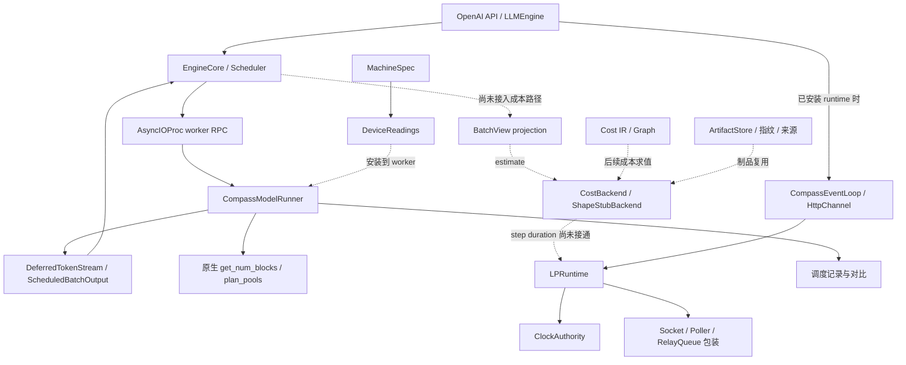
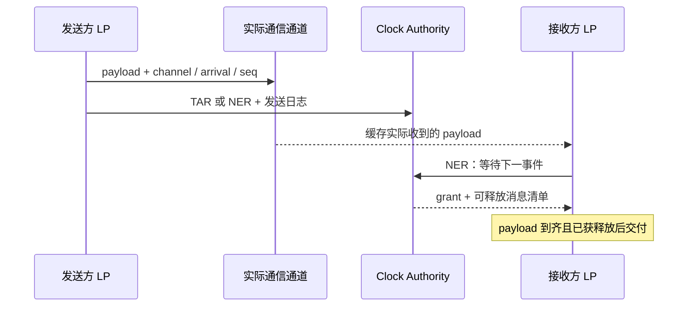

# ATOMCompass 技术架构与关键模块

本文梳理 `jgong5/ATOM` 中 ATOMCompass 的实现，重点回答三个问题：它复用 ATOM 的哪些能力、用什么机制替代真实执行，以及这些模块目前接通到了哪里。

**核心思路是保留真实推理引擎的调度和请求状态机，用可解释的成本、内存和通信模型描述目标设备，再以虚拟时间组织事件。分析版本已经实现了这些方向上的多个基础模块和接入点，但尚未形成完整的端到端仿真启动链路。**

## 1. 分析范围与版本

分析日期：2026-10-08。以本地已有 Git 引用和对应提交的代码为依据；下文源码链接固定到提交，避免后续分支更新改变结论。

| 代码范围 | 分析提交 | 本文用途 |
| --- | --- | --- |
| `main`（对照版本） | `83daf636d6f55aff1c407725849c504788cef06d` | 此处 `atom/compass/` 只有设计文档和 `.gitignore`，尚无 Compass Python 实现 |
| `origin/feature/atomcompass_new` | `fcfd9d5399b7c7664348e8178508f0ca2578e7b3` | **主体分析版本**：Runner、成本契约、内存模型、PDES 时钟和相关适配 |
| `origin/feature/atomcompass` | `07718dd496d8c25965577b98400ebdea0ec27bdc` | 对照既有预测、采集和独立 replay 实现 |
| `origin/feature/atomcompass_take2` | `38fb5d215af5e888a8a7b08819c374c7ba1bfc4c` | 对照较精简的 Runner / Oracle 结构 |

除第 11 节外，“当前实现”均指上述 `atomcompass_new` 快照。本文直接阅读实现和测试定义，没有把设计文档中的目标当成已实现功能，也没有进行 GPU 实测或运行这些分支的测试。因此，文中的“有测试覆盖”表示仓库存在对应测试，不代表本次执行通过。

## 2. 整体架构

可以将实现分为四层：

1. **ATOM 执行控制层**：HTTP 服务、请求处理、调度、KV block 管理和 worker RPC 继续由 ATOM 提供。
2. **执行替换与预测层**：Compass Runner 返回占位 token；batch projection、成本后端和内存读数描述目标工作量及设备资源。
3. **时间与通信层**：逻辑进程通过 Clock Authority 协调时间；通信包装器控制消息何时对应用可见。
4. **证据与复用层**：machine spec、成本来源、制品指纹、确定性检查和调度对比，使结果可以解释、追溯和核对。

下图中，实线表示已有调用关系或替换接点，虚线表示组件间预留的组合关系、尚缺少的安装逻辑或执行连接。带条件的接点要在 runtime / 读数由调用方安装后才生效。



其中最重要的边界是：**当前 `NonAllocatingRunner.forward()` 只记录调度信息并生成占位输出，没有调用 `CostBackend.estimate()`，也没有向 `LPRuntime` 提交 step 耗时。** 成本计算、时钟协议和 Runner 的存在，尚不能推出它们已经组成一个性能仿真器。参见 [Runner 替换方法][overrides]、[成本接口][backend-base]和 [LP runtime][runtime]。

### 2.1 关键模块索引

| 模块 | 关键对象 | 主要职责 |
| --- | --- | --- |
| `atom/compass/runner/` | `CompassModelRunner`、`NonAllocatingRunner`、`DeferredTokenStream` | 替换模型构建、warmup、KV 分配、graph capture 和 forward，保留原生调用协议 |
| `atom/compass/runner/projection.py` | `project()` | 将调度器对象转换为成本后端可消费的逐请求形状 |
| `atom/compass/backends/` | `CostBackend`、`BatchView`、`StepCost`、`ShapeStubBackend`、`Resolver`、`FakeModel` | 形状计价、来源记录、逐级寻找成本依据、声明模型几何 |
| `atom/compass/clock/` | `LpId`、`ChannelTable`、`ClockAuthority` | 逻辑进程身份、通道图、因果安全的时间授予 |
| `atom/compass/clock_transport/` | `serve()`、`connect()`、wire 编解码 | 在进程之间传递时间请求、grant 和终止信息 |
| `atom/utils/clock.py`、`zmq_shim.py` | `LPRuntime`、`WrappedSocket`、`WrappedPoller`、`RelayQueue` | 应用侧时钟、消息盖戳、延迟交付和 ZMQ 接入 |
| `atom/utils/compass_loop.py`、`atom/compass/carriers.py` | `CompassEventLoop`、`Station`、`SimExecutor`、`HttpChannel` | asyncio 时间适配、前端任务排队、HTTP / SSE 时间信息承载 |
| `atom/compass/memory/` | `ModelTerms`、`DeviceReadings`、`SizedKVPool` | 用模型和机器规格提供原生 KV 预算公式所需的读数 |
| `atom/compass/kv/` | `SimulatedKVConnector`、`TransferModel` | 模拟远端 KV 就绪、传输完成时间和 P/D 交接元数据 |
| `atom/compass/ir/` | `Graph`、`Op`、`Seq`、`Repeat`、`Par` | 表达算子、结构复用、并行关系和图的适用范围 |
| `atom/compass/spec/`、`artifacts/` | `MachineSpec`、`ArtifactStore` | 规格校验、制品发布、来源和失效条件管理 |
| `atom/compass/audit/`、`detect/`、`parity/` | 同步点清单、静态检测器、`StepRecord` | 检查时钟和迭代顺序，定位两次运行首次调度分歧 |

### 2.2 四个核心模块的职责分工

理解执行链路时，可优先区分 Runner、成本后端、虚拟时钟和内存模型。它们分别回答不同的问题：

| 模块 | 核心问题 | 与其他模块的边界 |
| --- | --- | --- |
| [Runner][runner] | 如何替换真实执行并继续驱动原生引擎？ | 保持 worker RPC 和输出协议；请求接纳、batch 选择和 block 管理由 ATOM 决定 |
| [成本后端][backend-base] | 已经选定的这一轮工作需要多久？ | 接收 batch 形状，返回 `StepCost`；计价本身不推进时钟 |
| [虚拟时钟][runtime] | 执行单元何时可以推进，消息何时可以交付？ | 接收完成时刻或下一事件申请，根据消息依赖授予时间；模型执行耗时由调用方提供 |
| [内存模型][memory-readings] | 目标设备能为 KV 留出多少容量？ | 提供设备读数，由原生预算公式计算 KV 容量，再通过 block manager 约束调度 |

完整仿真需要让资源约束影响 batch、让 batch 成本影响完成时刻，再让完成时刻影响后续调度。当前资源读数和成本到时间的接合仍有缺口，具体状态见第 10.2 节。

## 3. Runner 如何复用真实引擎

### 3.1 接入位置

实际入口是 ATOM 已有的 `Config.runner_qualname`：`LLMEngine` 接收配置，`EngineCore` 将类名交给 `AsyncIOProcManager`，worker 再解析并构造 `runner_class(rank, config)`。Compass 对应类名为：

```text
atom.compass.runner.model_runner.CompassModelRunner
```

该类使用多继承：`CompassModelRunner(NonAllocatingRunner, ModelRunner)`。替换方法排在方法解析顺序前面，原生 `ModelRunner.__init__` 仍然执行。[配置与 worker 接入][config]、[worker 类解析][async-proc]、[组合 Runner][runner]。

这使调度器、连续批处理、请求接纳、prefix cache 索引、block manager 等仍由原生 ATOM 决定，避免在 Compass 中另写一套调度逻辑。

### 3.2 替换内容与保留内容

| 阶段 | Compass 的处理 |
| --- | --- |
| 构建和加载模型 | 用无参数、无 buffer 的 `UnbuiltModel` 保存模型类身份；跳过真实模型构造和 checkpoint 读取 |
| Warmup | 跳过 |
| 读取设备内存 | 读取预先安装的 `DeviceReadings` |
| 计算 KV 容量 | 调用原生 `get_num_blocks()`，保存 `SizedKVPool` 记录 |
| 分配 KV | 保存 block 数并初始化空 KV 注册表、connector；不分配 KV tensor |
| 捕获 CUDA graph | 返回 `(0.0, [], 0)`；保留原生初始化的 eager fallback 状态 |
| Forward | 记录本轮调度，并返回符合 `ScheduledBatchOutput` 协议的占位输出 |

**完整 Runner 仍有设备依赖。** 父类仍会导入模型类、初始化 GPU / 通信环境、创建 stream / event、attention metadata 和 forward buffers。主要残留 buffer 与 `max_num_batched_tokens × hidden_size` 有关。因此，“不加载权重、不分配 KV tensor”不能理解为这个生产 Runner 已能在纯 CPU 上构造。[原生构造与 buffer 分配][native-runner]。

### 3.3 Token 输出保持调度语义

占位 token 选择不在 EOS / stop IDs 中的最小整数，让调度器按输出 token 预算继续推进；这里不预测文本内容。

`DeferredTokenStream` 区分三种情况：

| 情况 | 返回语义 |
| --- | --- |
| 单阶段、产生输出的 step | 返回上一个“产生输出的 batch”的 token；第一轮没有前序结果 |
| 纯中间 prefill chunk | 返回当前请求 ID，但没有 token；不推进上述延迟队列 |
| PP 多阶段 | 返回当前 batch 的 token |

关键是延迟按“产生输出的 step”计数。把每个 prefill chunk 都当作生成一步，会改变请求完成时间和后续调度。[输出状态机][step-output]、[驱动真实调度器的语义测试][test-runner-semantics]。

worker RPC 的返回形状也属于架构契约：部分调用会一直等待非 `None` 回复。`RPC_SURFACE` 显式记录这些方法，避免一个看似无害的空 stub 让调用方永久等待。[RPC 契约][overrides]。

## 4. 成本后端：从 batch 形状到可追溯耗时

### 4.1 输入是逐请求形状

`project(batch, seqs, runner)` 产生 `BatchView`，每个 `RequestShape` 保存：

- `query_tokens`：本轮实际处理的 token 数；prefill 时是 chunk 长度。
- `context_tokens`：attention 读取的上下文长度，包含本轮 token。
- `decode`：显式区分 decode 和 prefill，避免将单 token prefill 误认为 decode。

batch 还可以携带 `capture_rung`，表示原生 `ForwardMode.decide()` 判断出的 graph replay 档位。请求顺序和 history 必须与调度器快照一致。[形状投影][projection]、[形状与后端实现][shape-backend]。

逐请求表达保留了 `Σqᵢ²`、`Σqᵢ(kᵢ−qᵢ)`、`Σkᵢ` 等量。它们不能用“总 token 数 × 某个统一 context”替代，否则不同长度分布的 batch 会被错误地视为相同工作量。

### 4.2 输出必须有分解和来源

`CostBackend.estimate(batch_view) -> StepCost` 是主要契约，`describe()` 用于说明后端身份。`Tier` 声明 analytic / coarse / op-level 三种粒度；**枚举中有三种粒度不表示三套成熟后端均已实现**。

`StepCost` 由非空、名称唯一的 `CostTerm` 序列构造，总耗时每次都从这些 term 按固定顺序折叠得到，不能另外指定一个可能与分解不一致的 total。

每项成本携带 `Provenance`，区分 analytical、measured、fitted、interpolated、extrapolated，并记录来源及回退前的拒绝原因。`Resolver` 按调用方提供的来源顺序取第一个可回答的结果；全部来源都拒绝时抛出 `CostRefused`。它实现的是回退机制，具体来源与顺序需要上层提供。[成本数据模型][step-cost]、[来源与拒绝][provenance]、[解析阶梯][ladder]。

### 4.3 当前具体实现是形状 stub

当前分支的具体 `CostBackend` 实现是 `ShapeStubBackend`。它使用声明的系数计算：

```text
prefill = 固定项 + a·Σqᵢ + b·Σqᵢ² + c·Σqᵢ(kᵢ−qᵢ)
decode  = 固定项 + d·请求数 + e·Σkᵢ + f·graph_padding
graph_padding = capture_rung·max(kᵢ) − Σkᵢ
```

图 padding 只取 decode 请求；没有 replay rung 时为零。后端还会按声明的并行配置加入候选 collective 项，其计数包含本 worker 的 stack layer 数。

这些系数的用途是让成本随形状变化，从而验证调度和后续模块对成本的反应。它们**不是经过校准的硬件性能模型**。虽然 term 的 species 使用 `FITTED`，详细来源会明确标记系数是 declared，读取结果时必须同时查看这些标记。collective 项也携带候选性、层数代用等限定。[`ShapeStubBackend.estimate()`][shape-backend]。

`ProvenanceMix` 按 step 数和预测秒数分别统计回退占比。例如，少量 step 使用低可信来源，也可能占据大部分预测耗时；只看 step 覆盖率不足以判断结果质量。[运行级来源统计][step-cost]。

## 5. 虚拟时间与跨进程因果关系

### 5.1 LP、Channel 与 Clock Authority

这里采用保守式并行离散事件模拟（PDES）的时间管理方式：

- **LP（Logical Process）**：拥有一个模拟时钟的执行单元。它可对应单个调用进程，也可由多个 member 进程共同参与。
- **Channel**：声明消息源、目标和最小延迟 `lookahead_s`。`ChannelTable` 计算通道图上各 LP 间最小累计 lookahead。
- **Clock Authority（CA）**：维护各 LP 的时间、等待状态、已登记但未释放的消息，决定哪个 LP 可以前进。

时间系统在代码上分为三层：`atom/compass/clock/` 定义协调规则；`atom/compass/clock_transport/` 传递时间请求和回复；`atom/utils/clock.py` 提供应用侧 `LPRuntime` 及消息交付包装器。CA 只计算状态转移，它本身不读取真实时钟、不启动线程、不打开 socket；应用通过 `LPRuntime` 使用该协议。[通道图][channels]、[CA 实现][authority]、[CA 传输服务][clock-service]、[LP runtime][runtime]。

传输层提供 `inproc:` 和 `tcp://` 两种载体，共用编码格式和服务循环；CA 串行处理状态更新，为各 LP / member 分发回复。TCP 形式允许 CA 独立托管，但仍是一个中央协调器。通道工厂目前提供单 engine 和 1P1D 的基本拓扑，不能视为任意并行部署的自动拓扑生成器。

### 5.2 两类时间请求

| 请求 | `LPRuntime` 接口 | 含义 | 授予时间 |
| --- | --- | --- | --- |
| `TAR(t)` | `advance_to(t)` | 当前工作已由调用方计价，申请推进到完成时刻 `t` | 安全时授予 `t` |
| `NER(t)` | `next_event(t, t_daemon)` | 当前没有可执行工作，等待下一事件，最晚到 `t` | 目标、daemon deadline、最早未释放消息中的最小值 |

这里的 `t` 是目标模拟时刻；若工作耗时为 `d`，调用方需要基于当前时刻计算完成时刻。`advance_to()` 等待 CA 授予后更新本地时间，`next_event()` 还会返回实际授予的时刻。`t_daemon` 可省略，默认 `+inf`。[应用侧时间请求][runtime]。

每次请求都会携带上次请求以来的发送日志 `(channel, seq, arrival)`。CA 先登记发送，再更新等待状态，使尚在物理传输中的消息也参与因果约束。

设 `N[j]` 为 LP `j` 最早还可能产生消息的时刻，`D(j,i)` 为从 `j` 到 `i` 的最小累计 lookahead。通常只有满足下式，等待中的 LP `i` 才获准推进：

```text
N[i] < min(j != i) (N[j] + D(j,i))
```

`N` 按 LP 状态计算：运行中取当前时钟，TAR 取目标，NER 取目标 / daemon deadline / 未释放消息到达时刻的最小值。严格不等号避免追上一个尚未登记的同刻事件；所有 LP 都等待、零 lookahead 环路阻塞时，CA 按 `(N, LP 名称)` 选择恢复 grant，并将随后到达的同刻消息留给下一轮。[`_n()`、`_grant_due()`][authority]。

daemon timer 用于 metrics 等维护任务。CA 维护由真正工作和消息形成的 essential horizon，避免这些周期 timer 单独使运行永不结束。工作结束时向全部 LP 返回 `+inf`；模拟时间上界被突破或出现回溯事件时中止，并提供 LP 状态表。

### 5.3 消息收到和消息可见是两件事

`LPRuntime` 及 socket / poller / queue 包装器将交付拆为两个条件：**物理 payload 已到达，且 CA 已释放该消息**。应用不能因为操作系统先收到了字节，就提前看到模拟中尚未到达的消息。



这条协议已有内存 / socket 传输及组合测试。多个进程属于同一 LP 时，CA 按 member 聚合一轮请求：TAR 目标必须一致，NER 目标和 daemon deadline 各取最小值；全部 member 获得同一个 grant，但只收到自己拥有通道的释放清单。[LP runtime 与包装器][runtime]、[member 聚合测试][test-members]。

**当前集成边界**：生产代码中有 runtime 定义及条件适配点，但尚无创建 `ClockAuthority`、构造并安装各进程 `LPRuntime` 的完整启动调用链；engine step 也尚未接入 `advance_to()` / `next_event()`。协议层测试不能代替这一层的端到端验证。

## 6. 前端、tokenizer 与 HTTP 适配

`CompassEventLoop` 基于 `asyncio.SelectorEventLoop`，让事件循环的时间来源变为 LP 时钟。`CompassSelector` 将等待转换为下一事件请求；`Station` 和 `SimExecutor` 描述有限并发度下的排队与完成时间，避免线程实际执行快慢决定模拟服务时间。[前端事件循环][frontend-loop]。

`wrap_encode()` / `wrap_decode()` 可以保留实际 tokenizer 结果，并依据规格中的 tokenizer 项计入模拟耗时。`HttpChannel` 在请求已实际读入且获得 CA 释放后，按 `(arrival, seq)` 顺序交给 ASGI 应用；`CompassSelector` 在 station job 尚未完成或 inline 消息尚未取走时暂不申请时间推进。

时间戳通过两种载体传递：

| 方向 | 载体 | 作用 |
| --- | --- | --- |
| 请求进入前端 | W3C `tracestate` 中的 `compass=a:<arrival>;s:<seq>` | 携带模拟到达时间与序号；通道由接收端运行时确定 |
| SSE 输出流 | 注释行 `: compass a=<arrival> s=<seq>` | 携带事件的模拟到达时间与序号 |

`api_server._served_app()` 在已安装 runtime 时选择 `HttpChannel`，事件循环选择也有对应条件分支。[HTTP 接入][api-server]、[载体编解码][carriers]。

当前尚未接通的部分包括：tokenizer 包装器的实际安装、负载生成方的请求盖戳、完整启动器，以及 benchmark 对模拟时间的读取。现有 benchmark 仍使用真实计时；部分 SSE 读取路径直接对非空行做 JSON 解析，不能假定它们已支持 Compass 注释。前端循环收到结束 grant 后会停止，但相应 uvicorn 组合测试仍把 `Event loop stopped before Future` 作为预期现象，完整服务退出流程也需要继续接合。[benchmark 客户端][benchmark-client]、[事件循环测试][test-loop]。

## 7. 内存与 KV：保留原生资源约束

### 7.1 用读数替换设备查询

Compass 不另写 KV block 预算公式，而是向原生 `get_num_blocks()` 提供五个数：

| 读数 | 来源 |
| --- | --- |
| `total` | machine spec 的设备容量 |
| `peak_torch` | 权重、buffer、加载残留、常驻 forward buffer、activation 各项之和 |
| `non_torch` | spec 中按 TP width 记录的 driver / collective reserve |
| `cudagraph_overhead` | `graph_pool.reserves()`，表示 ATOM 预算算法实际会扣除的量 |
| `free` | `total - peak_torch - non_torch`，表示独占设备假设下的剩余空间 |

原生计算继续保留利用率、按总容量计的 2% safety margin、额外 reserve、与 `free` 取最小值以及 `plan_pools()`。STATE 类资源先满足请求槽位下限，PAGE 类吸收其余预算。[设备读数][memory-readings]、[原生 KV 预算][native-runner]。

每个内存 `Term` 都记录字节数、依据和来源。`ModelTerms.from_declared_config()` 为假模型提供声明公式，并明确标为 declared；它不是任意模型真实权重、buffer 和 activation 占用的精确测量。

`graph_pool.reserves()` 与 `graph_pool.predicts()` 有意分开：前者复现 ATOM 会如何预留，后者按 spec 中的形式预测 graph pool 占用。用后者直接替代前者会改变推算出的 KV block 数，从而改变所模拟的原生调度行为。[graph pool 两种读数][graph-pool]。

该模型假定设备由目标任务独占，不能预测其他进程争用显存导致的 OOM 或接纳突变。`install_device_readings()` 的配置到 worker 安装流程尚未接通，缺失时 Runner 会明确拒绝。

### 7.2 KV 几何与远端传输

`KvGeometry` 描述一个 worker 的 paged KV。对于它所表达的 K/V head 布局：

```text
bytes_per_block = paged_layers × block_size × 2 × kv_heads_per_rank
                  × head_dim × element_bytes
```

TP 决定每 rank 的 KV heads；PP 必须显式给出该 stage 的 layer range；混合模型需要辨认哪些层持有 paged KV。该公式的适用范围是这个几何类表达的布局，不能直接推广到所有 MLA、压缩 KV 或 recurrent state 格式。[KV 几何][geometry]。

`SimulatedKVConnectorScheduler` 沿用原生远端 KV 等待状态：请求获得一次 remote-prefill 声明，完成接纳与分配后，仅对真正进入 `WAITING_FOR_REMOTE_KVS` 的请求发布传输 metadata。worker 端 `SimulatedKVConnector` 不移动张量，按以下模型计算完成时间，并在到期后报告完成：

```text
transfer_duration = latency + bytes / (peak_bandwidth × derate)
release_time      = issue_time + transfer_duration
```

链路明确区分 intra-node / inter-node。它是基于规格的传输模型，尚不能当成经过 RDMA 部署校准的结果。[connector 状态机][kv-connector]、[传输计价][kv-transfer]。

P/D 交接 blob 保留原生字段形状，但使用 `compass-simulated.invalid` 和端口 `0` 表达模拟端点；请求本身的 block IDs、TP / DP 信息、首 token 等仍按协议传递。远端 KV 状态机支持、跨部署时间协调和完整 P/D 服务运行是不同层面的能力。[交接参数][kv-handoff]。

Compass Runner 在存在 KV transfer 配置时，只接受 `kv_connector="compass"`，会拒绝其他真实 connector，避免占位执行意外进入真实传输路径。[KV 分配接点][overrides]。

## 8. 模型表示、捕获路径与 Cost IR

分析这一部分时，需要区分三个名称相近、用途不同的对象：

| 对象 | 所在位置 | 表达什么 |
| --- | --- | --- |
| `UnbuiltModel` | `runner/overrides.py` | 原生 Runner 中的空模型占位；没有真实 module tree |
| `FakeModel` / `SyntheticStack` / `HfConfig` | `backends/model.py` | 从 JSON 配置或声明参数表达模型形状、并行宽度和 KV 几何，并构造 shape stub 后端 |
| `_CapturedRunner` + `FakeTensorMode` | `tests/compass/test_capture_real_model.py` | 在测试驱动中构造真实模型类和 module tree，执行形状层面的 forward 以收集事件 |

因此，当前 Compass Runner 并没有在内部自动建立真实 meta 模型、捕获算子图并完成计价。[模型形状声明][fake-model]、[capture 测试驱动][test-capture]。

capture 测试中已实现一条有意义的无设备诊断路径：声明 CUDA / 架构属性，使用 fake process group 保留逻辑 TP 宽度，以 FakeTensorMode 构造真实模型，调用原生 KV 分配和 forward，并记录算子、collective、符号形状及 guard。相关断言主要针对 vendored Qwen3.8-27B 配置的 TP1 / TP2 单个 decode step。

这条路径会拦截并跳过 raw Triton launch，记录明确带有 `diagnostic_inventory=true`。它提供算子和形状清单，尚不能等同于完整可执行图、数值等价运行或实测时间。

Cost IR 已有以下数据结构：

- `Op`：记录一个操作及形状、属性和上下文引用；区分 captured、opaque leaf、declared。
- `Seq`：顺序组合。
- `Repeat`：重复结构，携带索引绑定与分组依据，例如结构一致或逐项成本一致。
- `Par`：并行分支，显式选择 `MAX`、`RESOURCE_BOUND` 或 `EXCLUSIVE` 合并策略，避免一律用最大值代表重叠成本。
- `Graph`：包含 region 与必需的 `Applicability`，并检查是否还有未绑定索引。

这些结构为后续图复用和成本求值建立契约；当前 `Applicability` 仍是抽象接口，不能把 IR 类型定义理解为已完成通用 guard 求值器、自动 repeat 提取器或 op-level 成本后端。[IR 节点][ir-nodes]、[Graph 与适用性][ir-graph]。

## 9. Machine Spec 与制品管理

`MachineSpec` 将“目标机器具有什么能力”与“本次部署使用多少并行度、什么工作负载”分开。schema 包含 host CPU / tokenizer / IPC、设备容量与带宽、计算峰值、运行时常数、ROCm / AITER / RCCL 版本，以及互连延迟和带宽。[规格字段][spec-fields]。

其主要约束是：字段必须属于 schema；峰值字段配套 derate；关键运行时常数没有静默默认；按 TP width 测量的表缺少指定 width 时直接拒绝，而不自行插值。`merge()` 合并 probe fragment，`validate()` 汇总问题，`explain()` 说明依据，`echo()` / `digest()` 固定运行实际使用的规格。[规格读取][spec-machine]、[校验][spec-validate]。

`ArtifactStore` 管理 machine spec、shape population、op graph、price list、region terms、memory readings 和 coverage hull 等制品，核心机制包括：

1. **按语义键定位**：例如 op graph 按结构、price list 按 model / width / source root 定位，拒绝用一个任意文件路径代替身份。
2. **统一 rank 命名与拓扑检查**：要求声明的各 rank 成员齐全。
3. **来源可追溯**：记录实际执行的 source roots、命令、条件与 gate 状态，并校验成员内容摘要。
4. **不可覆盖发布**：先写 staging 目录，再整体发布；已发布条目不能被同名结果静默覆盖。
5. **按依赖判断失效**：load 时检查 gate 与指纹；op graph、price list、memory readings 对软件栈、模型、设备和引擎配置的依赖不同。

这些是已经实现的制品基础设施，但当前 Runner 尚未自动从中解析并加载一整套预测所需制品。[制品键][artifact-keys]、[发布与读取][artifact-store]、[失效矩阵][artifact-matrix]。

## 10. 正确性检查与当前支持边界

### 10.1 检查对象

| 检查方向 | 实现与现有测试 | 能说明什么 |
| --- | --- | --- |
| 调度语义 | `test_runner_step_semantics.py` | 占位输出能否驱动真实 scheduler 的 prefill / decode / postprocess |
| KV 预算一致性 | `test_kv_budget_engine.py` | 替换读数后是否仍使用原生预算与 pool planner |
| 因果与交付 | `tests/compass/clock/` | grant、member join、传输在途消息、确定性交付和终止协议 |
| 前端时间 | `test_compass_event_loop.py`、tokenizer / detok station 测试 | asyncio timer、排队和 HTTP 交付接点 |
| 隐藏真实时钟与不稳定迭代 | `detect/clock_source.py`、`detect/set_iteration.py` | 静态发现受检代码范围内的时钟来源和无序迭代问题 |
| 两次运行调度对比 | `parity/` | 逐 DP rank 找出首次 step 决策分歧 |
| LP 事件确定性 | `detect/determinism.py` | 比较按时间、LP、通道和序号规范化排序的事件表；不同于真实 serving 的端到端调度验证 |
| 结果来源与适用条件 | spec / artifact / provenance 测试 | 缺失、陈旧或不匹配数据是否被拒绝并说明原因 |

`ATOM_COMPASS_PARITY_RECORD` 为带记录接点的 Runner 启用调度记录。Compass Runner 已调用该接点；真实执行侧需要通过 `runner_qualname` 选择 `atom.compass.parity.runner.RecordingModelRunner`，仅设置环境变量不会使原生 Runner 自动记录。`StepRecord` 记录请求、scheduled token 数、context 和输出属性；请求键按完整 prompt 逐 chunk 累积，在 final chunk 命名。对比器按 DP rank 找首次分歧，拒绝把两个没有 step 的运行当作一致性证据。相同 prompt 的不同请求当前会被拒绝，开启记录时 PP 也会被拒绝。[调度记录与对比][parity]、[真实执行侧记录 Runner][parity-runner]。

CA timeline、LP 状态表、grant 计数、来源分解和 refusal 统计提供了诊断基础。静态检查和组件测试各自有范围，不能从“检查器存在”推导出任意模型、任意配置已经得到验证。[时间观测][observability]。

### 10.2 能力矩阵

| 能力 | 本快照的准确状态 |
| --- | --- |
| 真实 ATOM 调度流程复用 | Runner 替换机制与 scheduler 语义测试已存在 |
| 完整无 GPU 启动 | 生产 `CompassModelRunner` 仍依赖基类设备初始化；无设备真实模型捕获主要在测试驱动中 |
| 自动成本预测 | 后端接口、shape stub 和 projection 已实现；Runner forward 尚未调用它们 |
| 多进程虚拟时间 | CA、LP runtime、transport 与条件接点已实现；缺少完整 launcher 和 engine step 接合 |
| TP | 有几何分片、原生 TP 接入和 TP1 / TP2 capture 诊断；不能据此认定任意 TP 性能模拟完整 |
| DP | CA 支持多 member 组成 LP；但 batch projection 对 `data_parallel_size > 1` 明确拒绝，DP 成本路径尚未完整 |
| PP | 输出层支持当前 batch 语义，几何支持 stage layer range；projection 的 prefill history 核对可能拒绝，parity 记录也不支持 PP |
| EP / MoE | shape stub 有候选 collective 项；模拟 forward 不执行真实 routing，也不提交虚构的 EPLB 负载 |
| Speculative decoding / MTP | Compass Runner 在构造阶段明确拒绝 speculative config |
| RapidServe | 与 Compass Runner 组合被配置检查拒绝；`disagg_is_decode` 也在 KV sizing 中被拒绝 |
| KV transfer / P/D | 有模拟 connector、传输计价和交接字段；完整部署时间协调与服务链路尚需接合 |
| 校准后的硬件预测 | 当前 shape stub 不能作为这种证据；IR / spec / artifacts 的存在也不代表完整采集、拟合、验证流水线已接通 |
| 用户启动与 benchmark | 尚无完整 Compass CLI；仅指定 `runner_qualname` 不足以安装内存读数、时钟和成本后端 |

并行限制分别来自不同层，阅读时应检查 [projection][projection]、[Runner overrides][overrides]、[Config][config] 和 [parity][parity]，不能仅根据 ATOM 原生支持某个并行参数，就认为 Compass 也完成了该配置的仿真。

## 11. 与另外两条实现分支的关系

三个快照的功能组织不同，不能假定 `new` 已覆盖其他分支的全部功能。

| 分支快照 | 架构特点 |
| --- | --- |
| `atomcompass` / `07718dd4` | 同时有真实初始化的 `CompassModelRunner` 和独立无设备 `ReplayModelRunner`；共享预测逻辑。`TargetRecord` 提供 KV block 数、capture ladder 等启动答案，配置支持 predict / trace / measure 和可注入 Oracle |
| `atomcompass_take2` / `38fb5d21` | `CompassModelRunner(ModelRunner)` 仍执行真实父类初始化，主要替换 forward；Oracle 直接接收 `StepShape`，返回总秒数及可选 breakdown，保留逐请求 context 和 prefix-cache 信息 |
| `atomcompass_new` / `fcfd9d53` | 将 Runner、成本契约、内存读数、制品管理和跨进程时间协调拆成明确模块；强化来源、拒绝和适用性表达，但完整组合仍在接合中 |

前两者使用调度进程拥有的进程局部 `VirtualClock`，worker 回传预测时间，由调度进程推进；new 引入了多 LP 的 Clock Authority。旧 `atomcompass` 已有无设备 replay，因此不能把“首次实现 GPU-free replay”归因于 new。[旧版预测 Runner][old-runner]、[旧版独立 replay][old-replay]、[take2 Runner][take2-runner]、[旧版时钟][old-clock]。

## 12. 建议阅读顺序

第一次读代码，可按以下顺序建立整体认识：

1. [Runner 组合][runner]和[替换方法][overrides]：确定真实执行究竟在哪一层被替换。
2. [输出状态机][step-output]与[projection][projection]：理解调度语义和成本输入。
3. [成本接口][backend-base]、[StepCost][step-cost]、[shape stub][shape-backend]：区分预测契约和当前计价能力。
4. [DeviceReadings][memory-readings]与[原生 get_num_blocks][native-runner]：理解模型容量怎样影响调度。
5. [ClockAuthority][authority]和[LPRuntime][runtime]：理解跨进程因果关系与应用可见时间。
6. [前端事件循环][frontend-loop]、[KV connector][kv-connector]：理解 HTTP 和远端 KV 的时间边界。
7. [IR][ir-nodes]、[spec][spec-machine]、[artifacts][artifact-store]：理解后续成本求值及数据复用的基础。
8. [真实模型 capture 测试][test-capture]和[调度对比][parity]：判断已验证接口的范围与尚缺的集成环节。

若重点是理解成本怎样影响执行时序，可沿着 [projection][projection] → [shape stub][shape-backend] → [StepCost][step-cost] → [LPRuntime][runtime] → [ClockAuthority][authority] 阅读，依次追踪工作量提取、成本项计算、耗时组织、时间申请和跨进程协调。这是按数据与职责组织的阅读路线；当前 Runner 尚未把成本结果提交给运行时。

即使工作区停留在 `main`，也可直接查看固定提交，无需切换分支：

```bash
git show fcfd9d5399b7c7664348e8178508f0ca2578e7b3:atom/compass/runner/overrides.py
```

[runner]: https://github.com/jgong5/ATOM/blob/fcfd9d5399b7c7664348e8178508f0ca2578e7b3/atom/compass/runner/model_runner.py
[overrides]: https://github.com/jgong5/ATOM/blob/fcfd9d5399b7c7664348e8178508f0ca2578e7b3/atom/compass/runner/overrides.py
[config]: https://github.com/jgong5/ATOM/blob/fcfd9d5399b7c7664348e8178508f0ca2578e7b3/atom/config.py
[async-proc]: https://github.com/jgong5/ATOM/blob/fcfd9d5399b7c7664348e8178508f0ca2578e7b3/atom/model_engine/async_proc.py
[native-runner]: https://github.com/jgong5/ATOM/blob/fcfd9d5399b7c7664348e8178508f0ca2578e7b3/atom/model_engine/model_runner.py
[step-output]: https://github.com/jgong5/ATOM/blob/fcfd9d5399b7c7664348e8178508f0ca2578e7b3/atom/compass/runner/step_output.py
[test-runner-semantics]: https://github.com/jgong5/ATOM/blob/fcfd9d5399b7c7664348e8178508f0ca2578e7b3/tests/compass/test_runner_step_semantics.py
[projection]: https://github.com/jgong5/ATOM/blob/fcfd9d5399b7c7664348e8178508f0ca2578e7b3/atom/compass/runner/projection.py
[backend-base]: https://github.com/jgong5/ATOM/blob/fcfd9d5399b7c7664348e8178508f0ca2578e7b3/atom/compass/backends/base.py
[shape-backend]: https://github.com/jgong5/ATOM/blob/fcfd9d5399b7c7664348e8178508f0ca2578e7b3/atom/compass/backends/shape.py
[step-cost]: https://github.com/jgong5/ATOM/blob/fcfd9d5399b7c7664348e8178508f0ca2578e7b3/atom/compass/backends/cost.py
[provenance]: https://github.com/jgong5/ATOM/blob/fcfd9d5399b7c7664348e8178508f0ca2578e7b3/atom/compass/backends/provenance.py
[ladder]: https://github.com/jgong5/ATOM/blob/fcfd9d5399b7c7664348e8178508f0ca2578e7b3/atom/compass/backends/ladder.py
[channels]: https://github.com/jgong5/ATOM/blob/fcfd9d5399b7c7664348e8178508f0ca2578e7b3/atom/compass/clock/channels.py
[authority]: https://github.com/jgong5/ATOM/blob/fcfd9d5399b7c7664348e8178508f0ca2578e7b3/atom/compass/clock/authority.py
[clock-service]: https://github.com/jgong5/ATOM/blob/fcfd9d5399b7c7664348e8178508f0ca2578e7b3/atom/compass/clock_transport/service.py
[runtime]: https://github.com/jgong5/ATOM/blob/fcfd9d5399b7c7664348e8178508f0ca2578e7b3/atom/utils/clock.py
[test-members]: https://github.com/jgong5/ATOM/blob/fcfd9d5399b7c7664348e8178508f0ca2578e7b3/tests/compass/clock/test_member_join.py
[frontend-loop]: https://github.com/jgong5/ATOM/blob/fcfd9d5399b7c7664348e8178508f0ca2578e7b3/atom/utils/compass_loop.py
[api-server]: https://github.com/jgong5/ATOM/blob/fcfd9d5399b7c7664348e8178508f0ca2578e7b3/atom/entrypoints/openai/api_server.py
[carriers]: https://github.com/jgong5/ATOM/blob/fcfd9d5399b7c7664348e8178508f0ca2578e7b3/atom/compass/carriers.py
[benchmark-client]: https://github.com/jgong5/ATOM/blob/fcfd9d5399b7c7664348e8178508f0ca2578e7b3/atom/benchmarks/backend_request_func.py
[test-loop]: https://github.com/jgong5/ATOM/blob/fcfd9d5399b7c7664348e8178508f0ca2578e7b3/tests/compass/test_compass_event_loop.py
[memory-readings]: https://github.com/jgong5/ATOM/blob/fcfd9d5399b7c7664348e8178508f0ca2578e7b3/atom/compass/memory/readings.py
[graph-pool]: https://github.com/jgong5/ATOM/blob/fcfd9d5399b7c7664348e8178508f0ca2578e7b3/atom/compass/memory/graph_pool.py
[geometry]: https://github.com/jgong5/ATOM/blob/fcfd9d5399b7c7664348e8178508f0ca2578e7b3/atom/compass/backends/geometry.py
[kv-connector]: https://github.com/jgong5/ATOM/blob/fcfd9d5399b7c7664348e8178508f0ca2578e7b3/atom/compass/kv/connector.py
[kv-transfer]: https://github.com/jgong5/ATOM/blob/fcfd9d5399b7c7664348e8178508f0ca2578e7b3/atom/compass/kv/transfer.py
[kv-handoff]: https://github.com/jgong5/ATOM/blob/fcfd9d5399b7c7664348e8178508f0ca2578e7b3/atom/compass/kv/handoff.py
[fake-model]: https://github.com/jgong5/ATOM/blob/fcfd9d5399b7c7664348e8178508f0ca2578e7b3/atom/compass/backends/model.py
[test-capture]: https://github.com/jgong5/ATOM/blob/fcfd9d5399b7c7664348e8178508f0ca2578e7b3/tests/compass/test_capture_real_model.py
[ir-nodes]: https://github.com/jgong5/ATOM/blob/fcfd9d5399b7c7664348e8178508f0ca2578e7b3/atom/compass/ir/nodes.py
[ir-graph]: https://github.com/jgong5/ATOM/blob/fcfd9d5399b7c7664348e8178508f0ca2578e7b3/atom/compass/ir/graph.py
[spec-fields]: https://github.com/jgong5/ATOM/blob/fcfd9d5399b7c7664348e8178508f0ca2578e7b3/atom/compass/spec/fields.py
[spec-machine]: https://github.com/jgong5/ATOM/blob/fcfd9d5399b7c7664348e8178508f0ca2578e7b3/atom/compass/spec/machine.py
[spec-validate]: https://github.com/jgong5/ATOM/blob/fcfd9d5399b7c7664348e8178508f0ca2578e7b3/atom/compass/spec/validate.py
[artifact-keys]: https://github.com/jgong5/ATOM/blob/fcfd9d5399b7c7664348e8178508f0ca2578e7b3/atom/compass/artifacts/keys.py
[artifact-store]: https://github.com/jgong5/ATOM/blob/fcfd9d5399b7c7664348e8178508f0ca2578e7b3/atom/compass/artifacts/store.py
[artifact-matrix]: https://github.com/jgong5/ATOM/blob/fcfd9d5399b7c7664348e8178508f0ca2578e7b3/atom/compass/artifacts/matrix.py
[parity]: https://github.com/jgong5/ATOM/blob/fcfd9d5399b7c7664348e8178508f0ca2578e7b3/atom/compass/parity/__init__.py
[parity-runner]: https://github.com/jgong5/ATOM/blob/fcfd9d5399b7c7664348e8178508f0ca2578e7b3/atom/compass/parity/runner.py
[observability]: https://github.com/jgong5/ATOM/blob/fcfd9d5399b7c7664348e8178508f0ca2578e7b3/atom/compass/clock/observability.py
[old-runner]: https://github.com/jgong5/ATOM/blob/07718dd496d8c25965577b98400ebdea0ec27bdc/atom/compass/runtime/runner.py
[old-replay]: https://github.com/jgong5/ATOM/blob/07718dd496d8c25965577b98400ebdea0ec27bdc/atom/compass/replay/runner.py
[take2-runner]: https://github.com/jgong5/ATOM/blob/38fb5d215af5e888a8a7b08819c374c7ba1bfc4c/atom/compass/runtime/runner.py
[old-clock]: https://github.com/jgong5/ATOM/blob/07718dd496d8c25965577b98400ebdea0ec27bdc/atom/utils/clock.py
