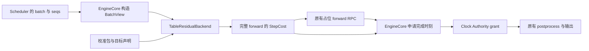

# ATOMCompass 查表与残差融合前向估时设计

日期：2026-10-08。状态：**Q1–Q7 已收敛，Q8 待确认；首版验收功能、配置切换与最小时钟闭环，不要求 GPU 预测精度达标或复现冻结预测**。

本文记录已核实的实现边界和可供评审的方案。首版交付包含可配置的成本后端、EngineCore 接点与最小时钟闭环，以 Kimi-K3 配置作为首个接入目标；设计内容不表示已经实现。

方法统一称为**查表与残差融合前向估时**（Table–Residual Ensemble Forward Estimation，TREFE）；后端类名为 `TableResidualBackend`，配置标识为 `table_residual`。方法名不携带实验轮次。校准包另外标识模型、硬件、并行配置和不可变制品摘要。原始文件名、类名和制品字段只在追溯旧资产时保留，不作为新接口名称。

**目标切换要求：在已支持的执行契约内，更换模型或并行配置只能改变输入，不能要求修改后端、特征计算或拟合／导出脚本。** 首个接入目标仍为 Kimi-K3、8×MI355X、TP8/DCP8，可以利用现有测量表和参数作为输入；历史预测结果的逐例复现不是交付目标。没有新目标的校准数据时，需要通过统一流程生成新包，不能只改名称或并行度就把旧参数标为已验证。

同一个后端也支持基础查表估时：校准文件可以选择不应用额外修正或残差融合，直接输出查表／恢复层的结果。这是估时链的配置选择，不要求另写一个 CostBackend。

## 1. 结论与依据

可以实现一个 `Tier.COARSE` 的 `CostBackend`，采用 `serving_simulator` 的查表与残差融合前向估时方法。现有 `CostBackend`、`BatchView`、`StepCost` 足以表达基础输入输出，核心适配不需要 Cost IR 或逐算子建模。

首版验收三件事：

1. **估时功能正确**：正确映射 batch，按所选表、公式、修正和融合配置计算，返回合法的整批次成本与来源。
2. **输入切换有效**：实际执行参数由 ATOM 提供，表、系数与模型由文件提供；基础／融合模式及支持范围内的目标切换不改代码。
3. **成本进入仿真时间**：一个 forward 计价一次，输出和后续调度受预测耗时影响，空闲、唤醒与结束可正常完成。

首版不以 GPU 预测误差或与旧预测器逐例相同作为通过条件。已有源码／数据核查提供方法依据；新后端和完整时钟接线尚未实现。模型、机器与执行契约的有效性检查仍保留，精度证据独立记录。

依据：

- 用户指定的 [ATOMCompass 架构分析](../../atomcompass_architecture.md)。
- 用户指定的本地文档 `/home/xingjche/codes/serving_simulator/docs/forward-time-estimation-round3-zh-CN.md`。
- ATOM 当前提交 `fcfd9d5399b7c7664348e8178508f0ca2578e7b3`。
- 估算器基准提交 `2ce181d212bba8b5280a7c4fe01c96f43f315c32`。本机验证使用 `serving_simulator/.worktrees/main-round3-ci-cache`；其 HEAD 是 `549967f`，相关估算器、融合模型源码和基础资产与基准提交的差异为空。
- 基础查表对照为 `serving_simulator` 远端 `main` 的提交 `257d6a9ddaf93bfb2e6a7131643d0ad1c6d0df96`，已于 2026-10-08 用 `git ls-remote` 核对；未使用本机另一个 main worktree 的旧 HEAD 代替。

## 2. 当前设计树

| 决策 | 当前状态 | 结论 |
| --- | --- | --- |
| Q1：首版接入目标 | 已确认，按最新验收要求更新 | Kimi-K3、8×MI355X、TP8/DCP8，保留更换参数包的边界；不再要求冻结预测复现 |
| Q2：首版接入范围 | 已确认 | 完整后端、EngineCore 接点和最小时钟闭环；完整 HTTP／benchmark 启动链路单列依赖 |
| 方法与接口名称 | 已确定 | 查表与残差融合前向估时；`TableResidualBackend`；`table_residual` |
| Q3：运行时的可变性边界 | 已确认 | 固定、参数化的推断组件；模型与并行差异通过目标配置和校准包表达 |
| Q4：域外与回退政策 | 已确认 | 保留并标注原有插值、外推、边界处理和已校准回退；禁止用无校准依据的固定占位值掩盖估时失败（原配置为 10 ms），覆盖辅助查表 |
| Q5：计时兼容性与验收 | 已确认 | 验收估时功能、配置切换和最小时钟闭环；GPU 精度与冻结预测复现均不作为首版条件 |
| Q6：配置感知与修正参数 | 已确认 | 从 ATOM 实际配置提取成本相关参数；按执行条件与校准配方决定修正项，系数从配置文件加载 |
| 基础查表模式 | 已核实可行，纳入配置设计 | 相同表和网格／恢复规则，加 `corrections: []`、`ensemble: null`，实现远端 main 的基础 table 方法 |
| Q7：运行期估时拒绝的处理粒度 | 已确认 | 终止本次仿真，保留拒绝原因并清理所有参与者；不跳过已调度批次继续执行 |
| Q8：原生 CPU 操作的实测计时 | 已确认，见 [ADR-0006](../../adr/0006-configurable-native-cpu-segment-timing.md) | `scheduler.schedule()` 与 `scheduler.postprocess()` 的计时方式三档可配：`off`／`measured`／`fitted`，默认 `fitted`；两段都产生 `CostTerm` |
| EngineCore 改动范围 | 用户已明确约束 | 尽量少改原生 EngineCore；计时与成本装配放在 Compass 适配层，保留原生调度和输出流程，具体接点见 §9.5 |

Q1–Q6 已收敛，最新的功能验收要求取代此前的冻结数值迁移门槛。Q6 明确的是后端应当知道实际执行条件，并从输入加载相应修正参数。目标 graph 元数据等事实缺少证据时记录为未知。计价边界见 [ADR-0001](../../adr/0001-table-residual-forward-clock-boundary.md)，输入化要求见 [ADR-0002](../../adr/0002-data-driven-forward-calibration.md)。

本轮补充的 Q7 已确认采用终止本次仿真的处理方式，Q8 正在讨论以宿主实测为原生 CPU 操作提供目标耗时估计。Q8 不改变复用原生 scheduler 的决定，也不要求为它另建调度决策模型；Q4 恢复政策和 Q5 验收边界保持已确认状态。数值有效性与失败诊断按现有计算契约细化。

领域术语见 [CONTEXT.md](../../../CONTEXT.md)。尤其区分历史上下文和包含本轮 query 的可见上下文。

## 3. 已核实的架构约束

| 约束 | 实现事实 | 设计影响 |
| --- | --- | --- |
| 后端契约 | `backends/base.py`：`tier`、`estimate(batch_view)`、`describe()` | 实现一个普通 CostBackend 即可 |
| 输入 | `RequestShape(query_tokens, context_tokens, decode)`，加 batch 的 `capture_rung` | 保留请求顺序和逐请求形状 |
| 成本组织 | `StepCost` 总量只能由有限、非负、名称唯一的 terms 相加得到 | 完整 forward 用一个 term；负残差不能成为独立计费项 |
| 依赖边界 | backend 包的测试禁止导入其他 `atom.*` 包 | EngineCore、配置、ArtifactStore 的装配代码放在 backend 包外 |
| Runner | `NonAllocatingRunner.forward()` 只有调度记录和占位输出 | 新 backend 不会自动参与 serving |
| 投影 | `project(batch, seqs, runner)` 需要 scheduler 的 seqs | worker 仅收到 batch，不能直接调用现有完整投影 |
| graph 元数据 | Compass 的 capture 替换保留原生 eager fallback `[0]` | 不能把它当成目标 GPU 的真实 capture ladder |
| 输出协议 | `ScheduledBatchOutput` 没有 duration；输出可能滞后一轮产出输出的 step | 不把 RPC 返回改成 `(output, cost)`，不改变 token 延迟状态机 |
| 平台限制 | 当前 projection 拒绝 DP>1；PP prefill 有历史校验限制；Runner 拒绝 speculation | 新成本模型不能顺带宣称这些场景已支持 |
| 时间装配 | 没有完整的 runtime 安装、engine step 计费与 idle NER 调用链 | 时间接线必须包含初始化和空闲推进，不能只加一次 `advance_to()` |

关键代码：[契约](../../../atom/compass/backends/base.py)、[成本](../../../atom/compass/backends/cost.py)、[投影](../../../atom/compass/runner/projection.py)、[Runner](../../../atom/compass/runner/overrides.py)、[EngineCore](../../../atom/model_engine/engine_core.py)、[输出状态机](../../../atom/compass/runner/step_output.py)。

## 4. 固定推断实现与输入化边界

### 4.1 交付参数化的推断组件

将查表／恢复、形状修正、特征计算和融合预测抽成固定实现，由 `TableResidualBackend` 读取统一校准包。运行时不按模型名写分支，也不为 TP4、TP8 等分别编写路径；它执行校准包选择的、已支持的特征配方和回归器。

修正和 residual ensemble 都是可选阶段。配置仅选择查表／恢复时，直接返回该层结果；不要求提供残差模型文件，也不为得到基线输出而构造一个虚假的回归器。

原运行时作为方法参考和可选的校准资产导入来源，不作为交付后端的直接依赖。其固定数据路径、目标专用格式、DCP8 校验及多处几何常量使简单包装不能满足目标输入化。新组件按明确的配方和参数契约实现功能；复用既有权重时仍需保持其特征含义、顺序和尺度一致，历史样例的逐例数值复现不作为门槛。

### 4.2 三类输入分别承担什么职责

| 输入 | 内容 | 变化规则 |
| --- | --- | --- |
| 目标配置 | 已解析的原生 ATOM 模型与并行配置，加上 MachineSpec 和必要的目标执行声明；包括精度／KV／attention 设置和 graph 策略 | ATOM 配置是执行参数的唯一来源；装配层提取纯值快照，供成本、内存和目标 graph 核对 |
| 不可变校准包 | 适用目标、测量表、网格与恢复策略、特征配方／顺序／尺度、可选 DCP 修正、回归器、成员权重／变换、验证证据 | 更换目标时选择对应的新包；不能只改元数据后继续用旧拟合参数 |
| 本轮工作量 | 有序请求的历史 context、query、阶段和本轮执行元数据 | 由调度快照产生，不由模型名称或静态配置猜测 |

用户只在 ATOM 原生配置中设置模型和并行参数，成本配置只选择后端、校准包和政策。校准包中的 `applies_to` 是适用性约束，不是另一份可以覆盖 ATOM 的执行配置。不能通过修改它把 DCP8 的旧权重变成 DCP1 的权重。

### 4.3 从实际执行配置构造后端快照

在 EngineCore 中，根据它实际收到的 native Config 构造不可变的 `CostTargetSnapshot`。这一时点晚于 `Config.__post_init__` 的规范化和 CoreManager 的部署改写；例如 `enable_dp_attention` 会改写 TP/DP，在最初 CLI 解析时保存快照会读到过时的值。首版对此类超出范围的组合明确拒绝。

| 成本相关条件 | ATOM 中的来源 | 用途／约束 |
| --- | --- | --- |
| 模型身份和结构 | `config.model`、应用 overrides 后的 `config.hf_config` | 模型标签与结构摘要、校准包匹配；不重新读取未应用 overrides 的原始 JSON |
| TP 与 DCP | 顶层 `config.tensor_parallel_size`、`config.decode_context_parallel_size` | 逻辑切分宽度、DCP 几何与修正资格；不按并行度直接缩放旧预测 |
| DP、PP、PCP | `config.parallel_config.data_parallel_size`、顶层 `pipeline_parallel_size`、`prefill_context_parallel_size` | 校准身份和执行能力检查；首版闭环为 DP1/PP1/PCP1 |
| EP 及 MoE 策略 | `enable_expert_parallel`、`enable_dp_attention`、`moe_ep_flatten_tp_across_dp`、`moe_backend` 等已解析设置 | 匹配实际执行路径；不能用一个假定的 `ep_size = tp * dp` 代替 |
| 精度和量化 | `torch_dtype`、`kv_cache_dtype`、已解析的 `quant_config` | 转为稳定字符串和量化规则摘要，保留分层覆盖；一个全局量化名称不足以代表实际权重 |
| KV 与 attention 分块 | `kv_cache_block_size`、`attn_prefill_chunk_size` | DCP／attention 几何；attention chunk budget 与 scheduler token budget 分开 |
| DCP 执行选项 | `dcp_config.interleave_size`、`enable_query_replication`、`enable_project_before_merge`、`comm_backend` | 已解析设置和已知的实际分支作为兼容性条件；请求 flag 不一定等于 kernel 最终启用状态 |
| graph 目标 | `enforce_eager`、`compilation_config.cudagraph_mode`、声明的 capture sizes，加有效目标 ladder 的证据 | 目标执行模式核对；占位 worker 的 `[0]` 不是目标 GPU 的 capture 结果 |
| 硬件与执行版本 | 目标 MachineSpec、ATOM／kernel／相关运行依赖版本 | 匹配校准环境；不把仿真宿主机的设备当成目标硬件 |

字段必须按版本化 schema 显式提取，不把整个 Config 或 HF 对象传进后端。快照只包含整数、布尔值、稳定字符串、元组等纯值；dtype、enum 和量化结构在装配层规范化。`CostTargetSnapshot` 可定义在 backend 包内，构建它的 ATOM adapter 留在包外，保持现有 import 约束。

当前 native DCP helper 的判定是顶层 `config.decode_context_parallel_size > 1`；合法的 `1` 表示未启用。缺失字段、0、负数不是 DCP1 的别名。`dcp_config` 默认总会创建，而关闭 query replication 也不等于关闭 DCP。`ParallelConfig` 中另有一个同名 DCP 字段，但 native helper／非 PP 初始化读取顶层值，不能误用那个嵌套副本。

规范化还要区分未启用与未知：DCP1 的 interleave／通信选项等专用条件标为不适用，不因未生效的默认值差异要求更换校准包；原始设置仍可写入运行记录。DCP 启用后，配方依赖的这些条件才参与几何计算和适用性检查。未知条件不能按“不适用”处理。

`config.tp_world_size` 与逻辑 TP 也不同：`fake_eplb` 时，前者可能只是实际启动的本地 worker 数。当前闭环拒绝该模式，不为了读取目标并行度去探测宿主 GPU；以后支持时需要分别记录目标切分和实例部署。无法从配置确定的实际 kernel 分支或历史 capture 信息必须保留未知状态，不能自动填成“已验证”。

构造接口示意如下；这些是拟议类型，不表示已有实现：

```text
ATOM 已解析的 Config + 目标硬件／执行声明
  → Compass binding 构造 CostTargetSnapshot
校准文件
  → 加载表、配方、修正系数、模型参数与证据
二者通过适用性检查
  → TableResidualBackend(target=snapshot, calibration=parameters, policy=policy)
每个调度批次
  → estimate(BatchView) → StepCost
```

静态执行条件在构造时注入；每步仍只传工作量及本轮执行元数据。后端不导入 `atom.config`、不调用全局 DCP helper、不访问 scheduler。模型身份、dtype 等可以只参与校准选择与校验；不能在已训练模型的特征向量末尾任意追加这些字段。

代码依据：[原生配置](../../../atom/config.py)、[DCP 判定](../../../atom/distributed/dcp_utils.py)、[部署改写](../../../atom/model_engine/engine_core_mgr.py)、[backend 隔离约束](../../../tests/compass/test_backend_interface.py)。

### 4.4 参数化几何，保持拟合语义一致

DCP 的 block size、并行度和 chunk budget 是执行参数；对于现有 interleave1 分块规则，通用几何为：

```text
virtual_block = block_size * dcp_size
local_width = max(block_size,
                  floor(chunk_budget / max(positive_contexts*dcp_size, 1)
                        / block_size) * block_size)
global_width = local_width * dcp_size
```

block128、DCP8、budget16384 是一个已知的几何配置实例。实现用可核算的形状案例验证分块公式及参数切换；其他 interleave／KV 分布规则需要已有的相应配方，不能仅改参数就假定当前公式适用。

按 [ADR-0003](../../adr/0003-injected-geometry-and-recipe-versioning.md)，这些常量由执行配置注入而非写死：`kv_cache_block_size`、`decode_context_parallel_size`、`dcp_config.interleave_size`、`attn_prefill_chunk_size` 取自目标快照，CU 数取自 MachineSpec 新增的 `device.compute.compute_units`。原实现在波次特征中枚举 `{128, 256, 304}` 三个候选分母——其中 256 是 MI355X 的 CU 数、304 是 MI300X 的——改为注入真实 CU 数乘以量纲为一的拟合标量 `occupancy`，由校准包提供。该族特征因此从 28 个降为 8 个。

注入不免除重新拟合：权重在某一组几何值上学出，换一组后函数相同但分裂点与系数失效。配方版本只在特征函数本身被改写时升级——换表、换网格、换 TP／DCP、换硬件都只要求新参数与新测量表；新增特征、改变特征定义或改变注入项集合才要求新版本。配方以具名版本加实现模块的 `code_digest` 标识，用旧摘要拟合的参数包在加载时拒绝。

另一方面，特征的 `/8192`、`/1048576`、attention 残差尺度中的 `50 ms` 等属于拟合语义，随配方和权重冻结。把调度 token budget 从 8192 改成 16384，不能据此改动旧模型的 query 归一化分母。网格节点、长度截断数量、tile／分位数集合也由校准包的配方版本和参数定义。

### 4.5 通用特征与可选执行特征

固定实现先提供真正独立于模型的 `batch_stats` 配方：B、Q、causal work、长度分布、有序位置、基线耗时等；需要时加入辅助查表特征。DCP 几何及线性修正作为可选配方，由适用的校准包启用。当前实验中的 `basic`／`existing` 特征已经混入 DCP 假设，不能直接改名当作通用特征。

不同 dense／MoE 模型在相同完整 forward 契约下，可以使用新测量表和新拟合参数承载其静态结构差异。MoE 的结果描述校准 routing 分布下的整体耗时；要显式预测每轮 expert 不均衡，仍需要相应动态输入，静态模型配置不能替代。

回归器首版支持当前实际使用的 ExtraTrees、RidgeTree 和 CatBoost；成员数量、feature names、权重和输出变换都由校准包列表驱动。首个包的 Prefill 五成员／Decode 三成员是数据，不是运行时限制。不引入任意 Python 插件或特征表达式语言来变相要求用户编写代码。

### 4.6 按执行条件和校准配方启用修正

每个 phase 的校准配方声明基线、可选修正列表、特征及 residual ensemble。独立 DCP 修正的适用条件为：

```text
apply_dcp_correction = (target.dcp_size > 1)
                       AND recipe 包含 DCP 修正
                       AND recipe 对当前 batch／基线的适用检查通过
```

这里的条件由固定实现解释为有限的已支持规则，不是可执行表达式。适用检查包括该修正的形状域和基线来源等条件；候选修正结果还要通过数值检查。它发生在目标与校准包匹配之后：加载 DCP8 包来估计 DCP1 应先报配置不匹配，不能靠自动跳过一项掩盖问题。

| 实际执行与配方 | 估时行为 |
| --- | --- |
| DCP1，匹配的无 DCP 校准包 | 不计算 DCP 修正及专用几何特征，不要求提供 DCP 系数；使用该包的基线与残差特征／参数 |
| DCP>1，配方包含独立 DCP 修正 | 使用实际并行度、block／chunk 等条件计算特征，从文件读取系数；域外按该修正的既定规则处理 |
| DCP>1，匹配配方不含独立 DCP 修正 | 允许基线与残差直接承载其影响；启用 DCP 不意味着一定需要一层独立修正 |
| 执行配置、修正配方或特征依赖不匹配 | 明确拒绝；不能临时删除已有模型的输入列、补零或改用另一套权重 |

现有参考包的 DCP 修正仅参与 Prefill；不能因 Decode 阶段也启用了 DCP 就再追加相同修正。无 DCP 包选择不依赖 DCP 的特征配方，特征顺序与输入维数仍与相应残差模型一致。

`ensemble: null` 明确表示不执行残差融合，最终值等于已经完成查表／恢复及所选修正后的基线。若同时 `corrections: []`，最终值就是查表／恢复层的结果。关闭的阶段不加载参数及专用依赖，不计算专供该阶段使用的辅助特征，也不产生“来源拒绝”；这与启用后因不适用而跳过的情况分别记录。

所有线性系数、残差变换参数、融合权重和回归器参数均由校准文件或它引用的制品提供。线性系数适合直接写进 YAML/JSON，大型树模型适合保留为有摘要的模型文件。运行时不按模型名内置一组 beta，也不另外暴露一个能与 ATOM 实际配置冲突的 `dcp_enabled` 用户开关。

残差模型的训练目标依赖其基线与特征。校准包必须记录基线表／恢复规则、修正参数、特征配方及输出变换的关联身份；禁用一项或改变系数后，需要沿统一流程验证并导出一致的新包，必要时重新拟合。这个过程改变输入文件，不改变推断实现；旧包的精度报告不能自动继承给新参数。

### 4.7 模型制品与推断依赖

新包使用稳定的推断格式和显式特征 schema。例如，RidgeTree 可表示为 scaler、linear 和 tree 三部分；如复用旧资产，由导入器转成这种格式，并记录来源和新制品摘要。兼容旧实验私有类路径和完整复制旧运行时均不是首版目标。

依赖按实际选用的回归器声明，只有启用的成员才加载参数及其推断依赖。基础查表模式不需要大型 ensemble 制品；选择 CatBoost 成员才需要相应推断支持。训练依赖与 serving 推断分开，避免导入未参与预测的训练库。

运行时不重新训练 ensemble。表恢复模型可以按配方在初始化时从输入 CSV 确定性构建，也可以加载导出参数；两种路径都应验证所声明的计算语义。运行环境使用新组件实际验证的依赖版本，不以历史实验环境的逐项复制为条件。

### 4.8 与远端 main 基础估时方法的关系

固定 main 提交的 `table` provider 执行“异构批次同构等效化 → 查表／插值 → 缺点恢复／校准回退”，没有 DCP 修正包装器或残差 ensemble。它的 `homogeneous.py`、`grid.py`、`table.py`、`recovery.py` 与冻结融合估时器所用的四个文件完全相同。

main 的 `all_point_results_4943.csv` 与冻结包的 `base_table.csv` 还是同一个 Git blob，SHA-256 为 `8c093aa119ef40f9ea7acbd1a5f9448249966fcde7a98fac7498acc3693fc7a2`。因此不需要用一组新系数逼近基础方法，只需加载相同基线输入并关闭两层增强。

| 配置 | 输出 |
| --- | --- |
| `corrections: []`，`ensemble: null` | 基础查表／恢复结果 |
| 启用匹配的 DCP 修正，`ensemble: null` | 修正后的基线 |
| 选择修正列表，并提供 ensemble 配置 | 查表与残差融合结果 |

基础模式仍可能在表内缺点恢复时使用小型拟合模型；关闭异构残差 ensemble 不会关闭这项原有能力。查表阶段参数也必须对齐：main 的默认 context step 为 4096，而 4,943 行表的示例显式配置为 16384、Decode minimum 为 8192。不能仅关闭残差，就忽略网格和测量表的差异。

关闭独立 DCP 修正不会改变 ATOM 的 DCP 配置。TP8/DCP8 实测表已经包含这种执行方式的物理耗时，基础查表模式同样可以服务这一目标；这些测量不能据此用于 DCP1。

还有一处必须单独声明的兼容边界：main 的表恢复失败后会调用未提供校准依据的 `MockCost`，4,943 行表示例的公式为 `10 + 0.001*Q ms`。它与冻结融合入口的固定 10 ms 占位值不同。按已确定的 Q4 政策，新后端实现 main 的查表、插值和已校准恢复方法，最终 mock 分支仍明确拒绝，因此不宣称对所有失败路径逐项兼容。

main 另有独立的 `mock` provider，默认公式为 `1 + 0.002*Q + 1e-9*A ms`，三个系数可以按配置中的 profile 覆盖。它是人工公式基线；仅把 `table` 的修正与 ensemble 关闭不会变成这个 provider。这里的兼容目标是基础 `table` 方法，未把默认 mock 系数当作已校准的性能模型。

远端依据：[provider 装配](https://github.com/Phi-C/serving_simulator/blob/257d6a9ddaf93bfb2e6a7131643d0ad1c6d0df96/src/serving_simulator/cost.py)、[4,943 行表示例](https://github.com/Phi-C/serving_simulator/blob/257d6a9ddaf93bfb2e6a7131643d0ad1c6d0df96/examples/kimi_k3_agentx_4943_hbm680_lmcache_off.json)。

## 5. 输入映射和不变量

对每个 `RequestShape r`：

```text
serving_simulator.c = r.cached_tokens
                   = r.context_tokens - r.query_tokens
serving_simulator.q = r.query_tokens
```

按 `BatchView.requests` 原顺序构造 `[[c1,q1], [c2,q2], ...]`。不能排序、合并请求或用总量代替原始行。

例如，Compass prefill 输入 `(q=2048, context=34816)` 对应源 provider 的 `[32768,2048]`；decode 输入 `(q=1, context=32769)` 对应 `[32768,1]`。

阶段选择：

- 所有行显式为 prefill：使用 prefill 模型，允许单 token prefill。
- 所有行显式为 decode：使用 decode 模型，并要求每行 `q=1`。
- 同时存在 prefill 和 decode：在没有执行路径和校准证据前拒绝；不拆成两次预测后求和或取最大值。

现有普通 scheduler 会先返回 prefill batch，再处理 decode；类型能够表达 mixed，并不意味着该模式已经校准。

Decode 的 `q=1` 不是临时限制，而是测量表的维度。`RequestShape` 的契约是"decode 一步验证的一个或多个 token"，scheduler 也已有 `scheduled_spec_decode_tokens`；但冻结表的 793 行 Decode 全部在 `query_length=1` 上采集，Decode 平面只有 `context × B` 两维。因此投机解码／MTP 属于与 DP>1 同级的未支持能力：它不是"等 Runner 放开拒绝就能用"，而是需要把 Decode 平面扩成 `context × B × q` 并重新测量。首个接入目标 Kimi-K3 属 DeepSeek 系，MTP 很可能是其实际部署配置，这一限制会直接影响首版可模拟的场景。

边界校验拒绝空 batch、布尔值或非整数 token 数、负历史长度、非正 query、未知 phase。projection 已将 NumPy 整数转成 Python int；后端不能通过截断小数来“修复”输入。

模型、设备、TP/DCP、block size、DCP interleave、attention chunk budget 和目标 graph regime 属于后端绑定的校准条件，不根据 phase alias 推断。源 provider 的 `kimi-k3-prefill` 等名称只选择阶段。

## 6. 查表与残差融合的参考计算配方

本节以已有校准资产说明计算配方。成员个数、网格、特征尺度和恢复参数属于输入配置；首版实现这些明确的计算语义，不要求复现旧预测器的全部冻结输出。其他校准包通过输入选择自己的已支持配方与参数。

### 6.1 共同基线

从原始 batch 计算：

```text
B = 请求数
Q = Σ q_i
A = Σ [q_i*c_i + q_i*(q_i+1)/2]
q_eq = Q/B
c_eq = A/Q - (q_eq+1)/2
```

使用源实现的 `Fraction` 语义。Prefill 在固定 B 的 context×query 平面查表。Decode 的批次轴由 graph 模式决定（[ADR-0005](../../adr/0005-decode-lookup-axis-follows-graph-mode.md)）：full graph replay 用 `capture_rung`，eager 用请求数 B；轴由 grid 文件声明，不在运行时按目标配置推断。冻结配置是 `context_step=16384`、`decode_context_min=8192`。

保留 exact lookup、bilinear interpolation、缺点恢复、有限 context 边界外推、另一轴补全、calibrated fallback 的原有次序。不能将最后的固定 10 ms fallback 当作经过校准的答案。

### 6.2 Prefill

先对符合条件的异构 batch 应用 DCP 基础修正，再运行五个模型并融合完整毫秒值：

```text
T0 = T_base + Σ beta_k * x_k
T_j = T0 + S_j(batch) * f_j(features)       # 四个缩放残差成员
T_cat = T0 * (1 + f_cat(features)/100)      # CatBoost 成员
T_prefill = Σ w_j * T_j
```

DCP 五个特征分别是 chunk 轮数差、context 总量差、轮数差与 Q 的交互、最大 context 差，以及最大 context 差与 Q 的交互。系数和 ensemble 权重从所选参数文件加载。

两种残差缩放是：

```text
S_context   = 1 + 64*Σc_i/1048576
S_attention = 50 + max(T0 - T_zero, 0)
```

`T_zero` 是将全部 query 合成一个零 context 请求的基线预测，不是另一项额外成本。

参考包的 Prefill 五成员为：`existing` 特征的 ExtraTrees（`gathered_context` 残差单位，权重 0.116）、`existing` 特征的 CatBoost（百分比变换，权重 0.150）、`ordered` 特征且带 `current_machine_adaptation={leaf:1, strength:1.0}` 的 ExtraTrees（`attention_cost` 残差单位，**权重 0.652**）、`existing_geometry` 与 `ordered_geometry` 两个 RidgeTree（权重 0.021 与 0.062）。权重最大的成员带机器适配层，由 `current_machine_fit.fit_adaptation()` 在一个先验模型之上拟合得到。因此这个包的适用条件不止模型、硬件型号与并行配置，还包括校准当时的具体宿主机器实例；其选模记录为 `Weights selected on development OOF labels; not independent or nested validation`。

旧 DCP 修正资产的适用条件包括 `B≤12, Q≤8192, max(c)≤1048576`。这些条件只控制该层是否应用，不能当作整个 ensemble 已验证的全域保证。符合修正条件且原基线使用 calibrated model 时，源代码先用另一份同构恢复模型替换该基线，再加五项 DCP delta。该恢复模型含 13 个系数，其中第一项是 intercept；它是单独的校准参数制品，不能把这个 intercept 混进五项 delta。选择这份修正配方时需要实现该分支并提供相应参数；基础模式或其他配方不因此被要求加载旧资产。

### 6.3 Decode

先按平均历史 context 和批次轴查表（replay 配方为 `capture_rung`，eager 配方为 B），再运行三个 RidgeTree：

```text
T1 = T0 / (1 - f1(features)/100)
T2 = T0 * (1 + f2(features)/100)
T3 = T0 * (1 + f3(features)/100)
T_decode = w1*T1 + w2*T2 + w3*T3
```

`RidgeTree = Ridge(StandardScaler(features)) + ExtraTrees(features)`。参考 Decode 包的机器校正已经合并在模型里，不能再追加一次。

三成员分别是 `ordered` 特征、power=-1、ape 加权的 RidgeTree（权重 0.461），以及两个 `position` 特征且带 `current_machine_adaptation`（leaf 4 与 leaf 16，strength 均为 1.0）的 RidgeTree（权重 0.114 与 0.425）。带机器适配的两个成员合计权重 0.539，与 Prefill 同属一类依附于校准宿主的参数，不能仅凭模型与并行标识判断可移植性。

部分 Decode 特征依赖请求的原始位置和 offset。训练分组所用、忽略排列的 shape hash 不能作为推断缓存键。

## 7. StepCost、来源和计时边界

两种模式都返回单一成本项；以下为融合模式的示意：

```text
StepCost([
  CostTerm(
    name="model.forward",
    seconds=estimated_ms/1000,
    provenance=Provenance(species=FITTED, ...)
  )
])
```

`Tier.COARSE` 表示建模粒度，两种模式均不改变 tier。来源按本次实际执行的估时链确定：

| 实际路径 | 最终 species |
| --- | --- |
| 使用拟合恢复模型、实际应用拟合修正或 residual ensemble | `FITTED` |
| 没有拟合阶段，使用测量点外推或边界钳制 | `EXTRAPOLATED` |
| 没有上述路径，使用测量点插值 | `INTERPOLATED` |
| 异构批次经同构等效化后 exact 命中测量点 | `ANALYTICAL`，记录由实测表支撑的等效近似 |
| 原始同构批次直接命中匹配执行条件与计时口径的测量点，无恢复、钳制或修正 | `MEASURED` |

组合路径按表中次序判断，完整的变换、恢复和域外状态仍独立记录。采用拟合模型时，即使输入域外也保留 `FITTED` 并在 detail 标记域外；一个 species 不承担两类信息。基础查表模式也可能返回 `FITTED`，因为其内部保留了校准恢复模型。上游 `method=exact` 仅说明等效形状命中表项，不能证明原始异构 batch 被直接测量；最终经过 residual ensemble 时同样不能标成 measured。

来源记录至少包含：phase、bundle manifest digest、目标快照与校准配置身份、特征／估时链身份、已应用或跳过的修正及原因、`baseline_ms`、`baseline_method`、`baseline_fallback`、`delta_ms` 和最终耗时；导入历史资产时附其原始摘要。使用已有 `Provenance.detail`／运行记录承载这些信息；不为诊断数据增加可相加的 CostTerm。

原融合 `predict()` 没有提供完整的逐个插值点、clamp 和每个模型贡献轨迹，其 `baseline_method`／`baseline_fallback` 也只描述顶层基线。特征构造中的 singleton 和零 context 辅助查表只保留标量，可能隐去自己的回退。首版不能将顶层字段当成整条预测链的完整来源；按 Q4 禁止最终占位回退的规则，必须在所有路径共享的查表 fallback 接点上执行，并在任何缓存预热前安装。

| 时间内容 | 归属 |
| --- | --- |
| 冻结测量口径内的模型计算、logits、内部 TP/DCP collectives 及其实际重叠 | 单一 `model.forward` 项 |
| DCP 线性 delta、学习型 delta、多个 ensemble 成员 | 预测诊断，不是互斥物理成本 |
| 请求排队和等待逻辑事件 | 由调度与事件时间自然产生，不追加一个固定排队成本 |
| 实际执行的 scheduler 与 scheduler CPU 后处理 | Q8 讨论中的推荐：分段实测宿主耗时，由 engine 计入目标时间；不加入后端的 `model.forward` 项 |
| GPU 采样与 worker 结果处理，包括相应 TP 广播、logprobs 及结果搬运 | 与 scheduler 后处理区分；现有 `run_model` 测量标签不能证明已覆盖，不能归入宿主 CPU 实测项 |
| worker dispatch／IPC、数据准备与其余拷贝等工作 | 按实际执行与测量边界分别处理；当前占位 RPC 的整段墙钟耗时不能代表这些工作的目标耗时 |
| KV 跨部署传输 | 由独立的传输模型计时，不并入本后端的整批次 forward 成本 |
| CPU 上执行估算器的耗时 | 仿真运行开销，不能加入目标设备预测 |

冻结资产记载的标签是 `run_model including logits + GPU synchronize; max rank wall time`。因此不能乘 TP8，也不能再加 ShapeStubBackend 的 collective 项。

这个口径**包含 logits、不包含采样**，而 `ModelRunner.postprocess()`（`model_runner.py:3095`）在 GPU 上执行 `self.sampler(...)`、spec decode 的 `index_select` 与拒绝采样、按配置发生的 TP 广播、logprobs 计算以及结果的设备到主机拷贝。这段工作在同一个 GPU 流上紧接 `run_model` 串行执行，当前没有任何成本项覆盖它。对 Decode 步而言 forward 基线只有十余毫秒，这段的占比不可忽略。首版沿用现有表并在运行记录中标明该段未覆盖；§10.4 的采集流程应把测量口径定为 `run_model + postprocess`，由下一个包补齐。不建议为采样单建一个成本模型——同一 GPU 流上串行的两段拆不干净。这一缺口与上文的投机解码限制相连：MTP 的额外成本有相当一部分正落在这段未覆盖区间里。

此处预测的 forward 按校准口径解释，不能与整个 `ModelRunner.forward()` RPC 等同。当前原生调用链在 `run_model()` 之后另行调用 `ModelRunner.postprocess()`，后者包含 sampler、按配置发生的 TP 广播／logprobs 计算及 token 结果搬运；“包含 logits”不等于“包含采样”。现有校准依据不足以为这些额外工作给出成本，首版应记录未覆盖。以后若纳入，需要对应目标测量或有依据的成本模型；不能用占位 RPC 的宿主耗时补齐，也不能把 GPU 计算或设备同步等待称为 CPU 实测。

一个待核实的差异是：当前 ATOM `run_model` 对纯中间 prefill chunk 跳过 logits，而该 bundle 的公开接口没有 final-chunk 或 logits 行数输入。本机不存在原始 GPU profiler，尚不能确认其所有 Prefill 样例的输出选择方式。首版允许沿用所选整批次配方估计中间 chunk，并明确记录这一未校准的近似；不以补齐历史测量证据为功能验收前提，也不能无依据减去一个固定 logits 常数。

当前代码中，只要 prefill batch 有一个 final chunk，`produces_output()` 就为真，LM head 又按 attention metadata 为各序列选最后一个 hidden state，而非只筛选 final 请求。因此运行记录需要保留逐请求 final-chunk 状态、`produces_output` 和实际 logits 选择规则；仅增加 final 请求数量不足以补齐计时口径。未知的历史口径也不能支持“当前预测一定偏保守”的判断。

毫秒到秒只转换一次，以后端计算的浮点毫秒构造 `StepCost.seconds`；受控样例应验证这个单位边界。`serving_simulator` 外层将毫秒向上取整为整数纳秒是它的事件计时策略，不自动成为 Compass 后端契约，也不要求逐位复现历史时间戳。

## 8. 适用性、拒绝和制品管理

### 8.1 区分三种支持范围

1. 数学接口接受的输入。
2. 查表、DCP 修正及缺点恢复各自可计算的范围。
3. 有独立数据支持准确性的目标执行配置与 batch 分布。

本次反例验证：源 provider 对 Prefill `Q=8193`、Decode `B=129` 仍会经 calibrated fallback 返回 ensemble 结果；Decode `c=0` 会触发基线 context 边界处理。这些都不构成准确性证据。

已确认的 Q4 政策是：保留所选配方的插值、外推、边界处理／clamp 和已校准的模型回退，并在每次预测中记录来源；最终无校准依据的占位兜底在所有查表路径中一律拒绝。允许计算不等于新增精度覆盖，来源仍标明域外／恢复情况。该政策只处理目标匹配后的形状缺点，不允许 checksum 错误、错误目标配置、非法输入或非有限／非正输出静默退回 shape stub。

这里的“最终兜底”指查表／恢复流程的最后一层回调。源实验的 `baseline_estimator()` 配置了 `fallback=lambda b, p: 10.0`：当所需插值点无法恢复，或域外批次也无法通过恢复模型估算时，忽略批次形状并提供固定的 10 ms。这个值没有测量或拟合依据，却可能继续进入后面的残差模型，也可能成为辅助查表特征，所以最终预测未必仍是 10 ms。

新后端在这一分支明确报 `CostRefused`，保留批次和失败原因，该步不以占位值推进仿真时钟。判定依据是估计来源；正常查表或模型预测恰好得到 10 ms 仍然有效，10 ms 也不是预测值的上限或下限。

这一政策有验证支撑：在新建 predictor 首次预测前，将所有查表共享的最终常数 fallback 替换为拒绝回调，全部 752 个冻结样例仍与原结果一致，未触发该 fallback。另一方面，这次检查的累计查表记录包含 81 次 context 外推、26 次 context 边界处理和 4 次 calibrated model 回退，以及 context／query clamp；这些包括特征构造的辅助查表，不是样例数量。全部禁止这些路径会改变既有验证样例的可用性。

新推断组件以明确的构造参数接受 fallback 政策，所有顶层和辅助查表共用该政策，并在形成任何缓存前完成安装。源运行时的验证使用共享 grid 的回调接点，不要求交付运行时继续依赖实验对象的私有字段。这是集成层的拒绝政策，不宣称原 provider 已经如此处理。

拒绝使用已有 `CostRefused` 和带稳定原因的 `Refusal`。允许的回退在 provenance 中记录未能直接查表的原因与实际采用的方法；有来源阶梯的拒绝链时一并保留，便于运行汇总统计受影响的 step 比例和预测秒数比例。`ProvenanceMix` 的 species 统计仍将最终融合结果归为 FITTED，不能单靠它区分某个辅助 lookup 是否外推；详细方法从 provenance／运行记录汇总。`Resolver` 是 term 级来源阶梯，不是 backend 注册器。

逐 step 的来源记录不能靠前后两次累计计数相减实现：预测缓存和 singleton 缓存会跳过查表。新推断组件让查询 metadata 随数值一起缓存，并让最终预测缓存包含完整来源；缓存命中仍返回相同来源。逐 step 计数和来源耗时占比从每次逻辑 `estimate()` 的返回结果统计，与内部执行过几次查表分开。

### 8.2 校准资产的加载

首版使用统一校准包 manifest；需要复用原格式时由导入器转换，不要求每个新目标保留原实验目录。无需先改写通用 ArtifactStore：

1. 装配层读取用户指定的 bundle 和预期 manifest digest。
2. 校验格式、manifest 身份、runtime inventory、模型和数据文件 SHA-256。
3. 校验安装的推断依赖版本或明确记录已经验证的兼容版本。
4. 校验目标校准配置、配方／回归器版本和能力范围；按 §8.4 区分已知不兼容与未验证证据，再加载模型参数、构造 predictor。
5. 固定后端实例的 bundle 身份；不在一次运行中原地热换模型。

新格式把模型、测量表和配方全部相对校准包定位。校验包括预期 manifest digest、资产摘要、推断组件／依赖版本，以及当前目标模型／GPU／TP／DCP／graph 模式；模型名称仅是可读标签，匹配依据还需包括模型配置、精度和执行配置的指纹。

旧入口的 bundle 环境变量只改变权重目录，基础 CSV 和特征脚本仍依附源码根。这说明新格式必须完整携带基线数据和配方，不能把“可更换权重路径”当作目标输入化已经完成。

冻结 CSV 共 4,943 行：4,150 行 Prefill 均为 eager，观测到的 batch size 为 1–11；793 行 Decode 均为 graph replay，观测到的 batch size 为 1–80。表中的 `graph_bs` 不等于完整有效 capture ladder 的证明。按 [ADR-0005](../../adr/0005-decode-lookup-axis-follows-graph-mode.md)，replay 配方的 Decode 网格建在 `graph_bs` 列上——该列在源实现中存在但未被消费——因此目标 graph ladder 成为该配方的硬依赖，缺失时按 A2 要求显式断言，未断言则拒绝该配方，不退回按 B 查表。实测覆盖（Prefill B 1–11、Q ≤ 8192、context ≤ 786432；Decode B 1–80、context ≤ 720896）由导出工具写入 manifest 的 `coverage` 节，仅作可读说明，不参与任何判定。

已观测的 Decode 映射为 `B=1 → rung=2`、`B=2…78 → rung=B` 和 `B=80 → rung=80`。B79 和 B81 以上没有对应观测；不能用常见的 1、2、4、8 等档位替代，例如它会把 B3 映射到 rung4，与已有测量的 rung3 冲突。目标执行声明和已观测映射要分别保存；缺失档位的处理必须体现未验证状态。

若以后统一归入 ArtifactStore，不能直接当作 `PRICE_LIST`：当前该种类的失效规则不依赖 model 和 engine config，无法表达此模型的适用性。是否复用整个 forward region 的 `REGION_TERMS` 或新增制品种类，应在确有统一分发需求时确定，并同时处理版本键和聚合而非逐 rank 的制品粒度。

### 8.3 当前代码与原校准版本

当前 ATOM 的 `aiter_mla.py`、`attention_mla.py`、`dcp_ops.py` 的 SHA-256 均不同于冻结 evidence 中的版本。这并不直接证明性能发生变化，但足以阻止“旧 bundle 已经验证当前实现”的结论。

首版记录当前执行版本与校准来源版本的差异，并将当前目标的精度状态标为未验证；无需先重建旧执行环境或完成同配置 GPU 控制测量。已知会破坏配方输入含义的执行差异仍按兼容性规则拒绝。以后若开展精度评估，再对最终／中间 chunk、graph 档位和长尾形状进行定向测量。

### 8.4 校准条件的证据强度

| 条件 | 当前证据与状态 |
| --- | --- |
| 模型、硬件、并行 | 测量协议和 DCP 资产声明 Full Kimi-K3、8×MI355X、TP8/DCP8，原 ATOM 提交为 `8915c0cd9912c0581eee6acec7910013769dea07` |
| KV dtype | 测量协议声明 FP8；更细格式和 runtime override 未完整记录 |
| DCP 几何 | DCP 资产和冻结特征代码固定 block128、attention chunk budget16384、interleave1 |
| 执行模式 | 测量协议声明 Prefill eager、Decode FULL graph；已观测 batch/rung 对来自 CSV |
| 完整 graph ladder | 未找到完整清单，不能由测量行反推所有未观测档位 |
| 权重量化与计算 dtype | 本地另一个配置 fixture 声明 MXFP4／BF16，但未证明它就是计时测量所用配置 |
| DCP 通信选项 | 当前代码还有 query replication、project-before-merge、comm backend 等开关；历史测量值未完整记录 |
| Prefill logits 选择 | 原始测量 harness 不在本机，冻结输入／特征未携带 final-chunk 或 logits-row 字段 |
| 校准宿主机器身份 | Prefill 权重 0.652、Decode 权重合计 0.539 的成员带 `current_machine_adaptation`，依附于校准当时的具体机器实例；manifest 记 `quality_scope: cross_host_control_gated`，跨宿主可移植性未验证 |

校准包区分已证实字段、目标部署的显式声明以及未证实字段。当前 fixture 不得自动补成历史测量事实。Q5 已确定不要求首版精度验证，检查分为两层：

- **运行所需的契约**：当前目标已解析；所选配方真正使用的几何／特征参数齐全；已知模型、并行、执行模式与适用条件无冲突；制品格式和摘要有效。不满足时拒绝。
- **预测准确性的证据**：精度细节、kernel 选项等缺失，以及尚无当前代码版本的控制测量，记录为未知／未验证，不单独阻塞功能验收。

按 [ADR-0004](../../adr/0004-graded-calibration-condition-checks.md)，具体条件按证据强度分四级：

| 级 | 条件 | 不匹配时 |
| --- | --- | --- |
| A1 | `kv_block_size`、`dcp_size`、`interleave_size`、`chunk_budget`、`compute_units`、`tp_size`、graph 模式、表摘要与网格参数、配方 `code_digest` | 拒绝加载 |
| A2 | `quant_config`、完整 graph ladder、prefill logits 口径 | 未在运行输入中断言则拒绝；已断言则放行并记为未验证 |
| B | DCP 通信选项、KV dtype 细格式与分层 override、`device.name`／`arch` | 记录，不拦截 |
| C | 分块宽度等由 A1 算出的派生量 | 不单独声明，只进 provenance |

A1 的成员有两类入组理由：进入特征计算（前五项），以及不进特征但构成测量表成立前提（后四项）。按"是否是特征"单一判据会把 `tp_size` 降级成警告，而 TP8 的包配 TP4 运行必须拒绝。A2 的断言写在运行输入而非校准包内：校准包是不可变证据，用户可改的内容不放进去；断言的语义是对测量历史的声称，校验比较的是断言值与 ATOM 已解析配置是否一致。

例如，声明了 DCP8 适用条件的包不能用于 DCP1；但缺少历史量化细节的包可以按显式目标声明参与首版功能仿真，同时保留其未验证状态。没有历史精度报告不等同于缺少可执行的校准参数。对依赖目标 capture rung 的配方必须提供目标 ladder；不依赖它的查表配方允许保留未知 rung，不能伪造历史档位。

### 8.5 启用阶段的失败与数值有效性

显式关闭一个阶段、配方规定某个 batch 不应用修正，以及已启用阶段发生错误，是不同的情况：

| 情况 | 处理契约 |
| --- | --- |
| `ensemble: null` 或未选择某项修正 | 正常执行所选的简化配方，不加载关闭阶段的参数和依赖 |
| `dcp_linear_v1` 不适用，或候选修正耗时未通过其既定有效性检查 | 保留 §10.3 已说明的配方规则，返回修正前基线并记录跳过原因；不能将此规则推广到所有推断错误 |
| 已启用阶段缺制品、摘要不符、特征 schema 不匹配或缺少依赖 | 初始化失败，指出 stage／member／artifact；不自动关闭阶段或减少成员 |
| 已启用 ensemble 的特征、残差预测、逆变换或融合结果无效 | 拒绝该次估时，保留成员及变换上下文；不剔除异常成员后重新归一，也不临时改为基础模式 |

原实现仅在融合后检查最终耗时，可能让某个成员的非正耗时被其他成员掩盖；新实现逐成员检查逆变换后的完整 forward 耗时，再检查融合结果。原始残差可以为负或零，但必须有限；完整耗时必须有限且为正。此检查保证计算结果有效，不设置 GPU 预测误差门槛。

百分比逆变换使用显式异常检查数学定义域，不依赖可被 Python 优化模式移除的 `assert`。例如 `T = T0 / (1 - z/100)` 要求分母有限且大于零，结果也有限且为正；首版不凭空增加接近零的阈值或最大耗时裁剪。毫秒转秒之后仍检查数值有效性，engine 在执行 forward 前还要检查计划完成时刻可表示且有限。

阶段加载错误在首次 `schedule()` 前尽量暴露；运行期估时拒绝用现有 `CostRefused` 保留 `request` 与 `declined`，并附校准包身份、batch／request IDs 和出错阶段。按已确认的 Q7，由运行控制层终止本次仿真并清理参与者；backend 自身不操作时钟或退出进程。

## 9. 最小时钟闭环

### 9.1 首版可控边界

首个真实校准案例是一个 engine、DP1、PP1、PCP1、一个 TP8 组。TP/DCP 数值从 ATOM 的实际配置和匹配校准包读取，不在时间接点中写死。Q6 的配置感知要求不新增多 DP／PP 调度或新的 EP 执行语义；继续保留当前对 speculation 等执行模式的拒绝。组级 profile 已给出各 rank 的最大 wall time，因此一个逻辑 forward 只计价一次。

现有 `wait_out=True` 只接收 primary output，并不收齐八个 rank 的 forward 计时；forward 也不在全 rank barrier RPC 列表中。TP 组耗时必须来自已汇总的 profile，不能用这次 rank0 RPC 的真实返回时间替代。

最小接点优先考虑 EngineCore：它在 `schedule()` 返回后同时持有 `scheduled_batch` 和 `seqs`，随后阻塞等待现有 `forward` RPC，最后调用 scheduler postprocess。这里可复用 `request_rows()`，避免把整个 Sequence 或新增复杂投影协议传给 worker。



```text
schedule()
  → 对当前 batch/seqs 做快照和合法性检查
  → 用经过校验的目标执行元数据构造 BatchView
  → estimate() 得到本次完整 forward 秒数
  → 执行现有占位 forward RPC
  → 由拥有时钟的线程申请模拟完成时刻
  → grant 后继续原有 postprocess／输出协议
```

只给真正执行的 batch 计价。中间 chunk 虽然不产生 token，也消耗 forward 时间；排空上次输出的语义由原状态机决定，不能以是否收到 token 推断是否执行了新的 forward。

这个接点表达一次阻塞 forward 的原子完成。更精细的 GPU／CPU overlap、PP 流水线和多 DP 同步不是将这个数拆成几项就能得到的能力。

### 9.2 不可省略的接线工作

- 在 EngineCore 构造 queue/socket 前安装所需 `LPRuntime`、LP 身份及通道配置；晚装可能已错过包装器创建。
- busy step 使用 owner thread 的 `advance_to(start + duration)`。backend 自身不调用时钟，也不真实 sleep。
- idle step 接上 NER，处理下一请求、KV 完成和结束事件；只加 busy TAR 会留下唤醒和终止缺口。
- 明确时间消费者在 engine，避免 worker 和 engine 对同一 forward 重复推进；多 member 的 TAR 需要相同目标，CA 不自动替各 member 求最大值。
- 在 EngineCore 一侧持有目标执行声明；有目标 graph ladder 时核对其合法性并复用 `ForwardMode.decide` 的 DP1 规则。保持占位 worker 的真实 `[0]` 不变；不能把不存在的真实 capture 写进 worker 状态。未提供历史 ladder 不阻塞不依赖 rung 的配方，未知状态和近似需随运行记录保留。
- 目标 ladder 必须符合目标 `max_num_seqs`、token budget、query width 和 graph 模式；已知 eager／replay 冲突不能直接套用另一模式的数字。目标声明与历史测量的匹配尚未验证时按 §8.4 记录。内存读数的 graph reservation 也来自同一目标输入。
- 保持 `ScheduledBatchOutput` 和 `DeferredTokenStream` 语义，在 grant 前不发布尚未完成的本轮可见效果。
- 完整服务还需要 DeviceReadings 安装、工作负载输入、输出时间和指标读取的启动链路；选择 HTTP 路径时还需 HTTP 时间适配。backend 的 CPU 推断能力不能替代这些工作。

最小时间闭环仍需匹配的 traffic／frontend LP 参与通道协议；可以先由合成测试驱动提供，不能仅安装 engine LP 就等待未盖戳的真实请求自动进入模拟时间。

以上接线属于首版交付范围，尚不是已通过测试的端到端实现。完整 HTTP／benchmark 启动链路作为后续依赖，不计入最小合成闭环的完成条件。

当前“哪些事件推进时间”需要区分时钟组件与生产装配。现有 LP 主时钟通过两个入口取得授权：`advance_to(T)` 用 TAR 推进到已计价工作的完成时刻；`next_event(t, t_daemon)` 用 NER 等待目标期限、消息到达或允许触发的后台定时器。只有得到 Clock Authority 的 grant 后才更新 LP 时间，普通函数执行、`clock.now()` 读数和 `CostBackend.estimate()` 返回数值都不自动推进它。

| 时间来源／事件 | 已有机制 | 当前接入状态 |
| --- | --- | --- |
| 批次 forward 完成 | 后端可提供 `StepCost`，owner 可申请 `advance_to(start + duration)` | 普通 EngineCore 尚无估价与消费接点，属于本次首版待实现内容 |
| 请求、控制消息与输出消息到达 | send stamp 记录到达时刻，接收方通过 grant 释放消息；空闲等待可以推进到该时刻 | channel／socket 包装已存在；完整 runtime 启动链尚未装配 |
| tokenization／detokenization 完成 | `wrap_encode`／`wrap_decode` 按固定成本与 token 速率计价；owner 直接推进，station job 则先累计成本、再安排完成定时器 | 包装器和 station 已存在，生产 tokenizer 尚未绑定这些包装器；不是宿主耗时自动测量 |
| event-loop 定时器与 owner socket 的有期限等待 | `CompassSelector` 和 inline `WrappedSocket.poll()` 调用 NER | 需要预先安装并启动 runtime；API 已有条件性选择入口，但不负责 runtime 安装 |
| scheduler／调度器后处理完成 | 当前没有独立计价与时间推进 | CPU 实测仍为 Q8 提案 |
| 采样及其他 worker 结果处理 | 当前没有独立计价与时间推进 | 按 §7 记录现有 forward 测量口径外的未覆盖工作 |
| KV transfer 完成 | Compass connector 计算 `release_at_s`，在读取的时钟到期后报告完成 | connector 不主动推进时间，也未将该期限注册为唤醒事件；不能将“有完成期限”视为完整事件接线；首版范围未接 KV connector |

消息发送本身不推进发送者：当前 `stamp_send()` 使用发送时刻加通道声明的延迟作为到达时间，再由接收方的授权处理。后台收包线程的 `WrappedPoller` 只等待消息释放，不自行推进 LP 主时钟。metrics 等 daemon timer 只在必要业务时间覆盖其期限时触发，不独自让仿真无限运行；正常结束的 `+inf` grant 是终止标记，不是一段计入延迟的服务时间。

当前普通生产入口未构造、安装并启动完整的 `LPRuntime` 链；没有 runtime 时 `clock.now()` 仍返回原生真实时间。因此现状不能表述为“生产 EngineCore 已由 forward 推进虚拟时间，只是 CPU 工作按零计费”。接上本次最小闭环、暂不启用 Q8 后，才会出现这样的例子：在逻辑时间 0 执行调度，预测 forward 为 5 ms，owner 取得 5 ms grant 后执行调度器后处理；两个 CPU 区段均不额外计价。若按原 deferred-output 协议本步有输出可发布，就在 engine 的逻辑时间 5 ms 对外入队，接收方可见时间还包括声明的通道延迟。若 engine 随后空闲且下一请求的 engine 到达时刻为 12 ms，NER 可推进至 12 ms。在 forward 区间内到达的请求仍按到达时刻入队等待，不能将其到达时间额外累加到 forward 成本上。

依据：[时钟授权入口与消息释放](../../../atom/utils/clock.py)、[tokenizer 成本与 event-loop 等待](../../../atom/utils/compass_loop.py)、[Clock Authority](../../../atom/compass/clock/authority.py)、[KV 完成期限](../../../atom/compass/kv/connector.py)、[API 条件性启动接点](../../../atom/entrypoints/openai/api_server.py)。

### 9.3 Q7：运行期估时拒绝后的收尾（已确认）

原生 `schedule()` 已经修改请求和 KV 状态：它可以分配 block、移动 waiting／running 请求、处理抢占和提取本轮 state maintenance 操作。估价虽在 forward 前，调度仍不是一项可直接丢弃的只读计算；现有 abort 请求也不是这一路径的事务回滚接口。

遇到运行期 `CostRefused` 就终止本次仿真：该批不调用 forward、不推进其 forward 计算时间、不调用 postprocess，也不重新 schedule。记录首个拒绝原因并复用原生 engine／worker 退出路径；运行控制层同时关闭时钟服务或连接，结束其余参与者的等待，将运行标为失败。已完成步骤可保留用于诊断。

故障退出需要独立于正常结束处理。当前 `LPRuntime.end_run()` 只更新运行标记，`close()` 要求已经获得 `+inf` grant；engine 子进程抛异常不会自动完成其他 LP 的收尾。不能为了通过正常结束检查而伪造 `+inf` 时间。最小时钟集成需覆盖这一异常路径。

依据：[Scheduler](../../../atom/model_engine/scheduler.py)、[EngineCore 退出路径](../../../atom/model_engine/engine_core.py)、[LPRuntime](../../../atom/utils/clock.py)。

### 9.4 Q8：原生 CPU 区段计时（已确认）

首版直接调用 ATOM 原生 `scheduler.schedule()`，由它选择请求、分配 KV 并构造批次；`TableResidualBackend` 接收这个实际批次，只估计 forward 耗时。复用原生调度逻辑不需要另建 scheduler 成本模型。

本文的“调度器后处理”专指 `scheduler.postprocess()`：消费已经返回的 token 结果，更新请求状态、KV 元数据和输出队列。它与 worker 中的 `ModelRunner.postprocess()` 是两个调用；后者包含作用于 GPU logits 的采样，以及按配置发生的通信、logprobs 和设备到主机拷贝／同步。Q8 推荐测量前者，不能将所有名为 postprocess 的函数或所有非 `run_model()` 工作归入 CPU 区段。相应 forward 测量口径和未覆盖项见 §7。

宿主上实际执行这些原生操作得到的 wall-time，可以作为目标部署相应区段的耗时估计。在目标机器上运行仿真，并保持 CPU／NUMA、绑核、进程与线程配置、代码路径和输入状态接近目标，是有价值的估计方式。相同机器本身不能保证全部非 forward 工作准确：加速仿真会改变 CPU 活跃节奏、缓存与资源竞争，且被占位替换的工作没有真实执行。

因此按 [ADR-0006](../../adr/0006-configurable-native-cpu-segment-timing.md) 将计时方式做成三档配置，默认不使用在线实测：

| 档 | 行为 | 用途 |
| --- | --- | --- |
| `off` | 两段不计时、不推进 | 首版先打通 forward 闭环 |
| `measured` | 实测宿主墙钟并推进，同时落盘样本 | 采集拟合数据；或用户显式要求真实 CPU |
| `fitted` | 按校准包的 CPU 配方预测并推进 | **默认** |

在线实测会使同一输入两次运行得到不同时间线，宿主到目标的比例因子 `1.0` 也是未经检验的断言，因此不作默认。三档共用同一组 EngineCore 接点，换的只是数据来源而非接线；一个区段只取一种成本来源，不混用。选用 `measured` 时运行记录打不可复现标记，§11.2 第 7 项的因果验收限定在 `off` 或 `fitted` 下执行。

两档都产生 `scheduler.schedule` 与 `scheduler.postprocess` 两个 `CostTerm`，使 `ProvenanceMix` 覆盖全部仿真时间、不同模式的运行记录可横向比较。`fitted` 记为 `FITTED`；`measured` 记为 `MEASURED`，并在 detail 中强制标明系宿主实测、宿主非目标——Compass 的 `MEASURED` 通常指目标设备实测，该标注区分二者。CPU 配方与 phases 并列写在校准包中，例如 `schedule` 使用 `[intercept, batch_size, waiting_count]`、`postprocess` 使用 `[intercept, batch_size, finished_count]`，其系数单位为毫秒；`intercept` 是恒为 1 的常数项，对应与批次形状无关的固定开销，须非负且任何输入下预测总时长为正。

`measured` 模式在仿真中采集的样本受占位 forward 与 Compass 自身记账影响，可作为首个配方的起点，不足以作为最终依据；该限制随样本一并记录。

| 区段 | 可测内容与完成边界 |
| --- | --- |
| `scheduler.schedule()` | 测量本地调度与 KV 元数据处理；返回后推进相应逻辑时间，再允许输出被拒绝请求的结果 |
| `scheduler.postprocess()` | 测量原生状态更新、token 整理和本地队列操作；返回后推进时间，再向 `output_queue` 发布结果 |

上述结论限于已定的 DP1/PP1/PCP1 闭环，且未绑定 KV connector。`postprocess()` 使用的 `stream_output_queue` 在当前普通 EngineCore 中由同一个线程随后排出，外部发送线程消费的是 `output_queue`；因此可以在真正发布前完成段末计时。若接入其他 connector，需要重新核对区段内的外部副作用。

当前串行 step 的推荐顺序为：

```text
实测原生 schedule → 推进 d_schedule
  → 构造 batch 快照并估计 forward
  → 执行原有占位 forward RPC
  → 推进预测的 d_forward
  → 实测原生 scheduler.postprocess → 推进 d_postprocess
  → 发布输出与 KV 事件
```

例如 `d_schedule=0.2 ms`、`d_forward=5 ms`、`d_postprocess=0.1 ms`，在这三个串行区段内共推进 `5.3 ms`。这不是整个服务所有非 forward 工作的完整计价；输入处理、其余 engine 工作及后台线程并不因上述两个计时器而自动获得覆盖。并行区段或不同 LP 的持续时间不能直接相加。

实测使用限定在测时适配层的真实单调时钟，例如 `perf_counter_ns()`；按现有 clock-source 检查记录这些读数的用途。`clock.now()` 继续读取逻辑时间。测时器在 `estimate()`、占位 RPC、`advance_to()`／等待 grant、诊断与仿真管理工作之外启停，避免把这些额外运行开销当作目标 CPU 工作。测时段只选一种成本来源，不能同时应用实测值和该段的另一份成本模型。

原生区段仍按原子完成处理：调度选择使用区段开始时的逻辑状态，区间内新到达的请求在段末 grant 后等待下一次 owner 处理。段内生成的完成时间戳需要与段末可见性一致，不能只延后发送队列。当前 `scheduler.postprocess()` 会在内部设置 `seq.first_token_time`，采用此方案时应将本次新产生的首 token 完成时间落实到该区段的完成时刻；已存在的首 token 时间保持原值。

当前 Compass 替换的是 `ModelRunner.forward()` 这一层：原生版本还包含输入准备、真实 sampler、staging fence 和数据拷贝等工作，占位版本则执行合成输出及仿真记录。由此，占位 RPC 的 wall-time 既包含额外工作，又缺少真实 worker 工作；即使在目标机器运行，也不能直接把它当作“GPU 前向以外的所有成本”。不在现有 forward 测量口径内、又没有真实执行的工作，应明确记录未覆盖，不能用占位执行时间代替。

测时范围、启用模式和必要的宿主到目标比例因子由 Compass 运行输入提供；在目标机器上实测时比例默认 `1.0`，跨机器比例需要另有依据。运行记录分别保存原始宿主持续时间、采用的目标持续时间、测时区段及宿主／目标条件，`TableResidualBackend` 的输入输出契约保持不变。若采用此方案，功能验收检查分段计时、时间戳和排除仿真开销的行为，不增加 CPU 或 GPU 精度门槛。

Q7 继续要求估时拒绝时终止本次运行。若 Q8 启用 CPU 实测，拒绝前已执行并计入的 CPU 区段属于已发生的工作，保留其时间和诊断；不追加被拒绝批次的 forward 时间，也不回滚逻辑时钟。

这不表示排队时间为零。比如请求在逻辑时间 1 ms 到达，而 engine 正在执行一个 5 ms 才结束的 forward，它仍需等待调度。请求到达、所支持的 KV 完成事件以及结束事件按其逻辑时间处理；idle NER 继续负责相应唤醒与终止。

依据：[原生调度与输出接点](../../../atom/model_engine/engine_core.py)、[首 token 时间与本地输出队列](../../../atom/model_engine/scheduler.py)、[原生 worker forward](../../../atom/model_engine/model_runner.py)、[GPU 采样实现](../../../atom/model_ops/sampler.py)、[占位 forward](../../../atom/compass/runner/overrides.py)、[时钟与输出时间戳](../../../atom/utils/clock.py)、[真实时钟读数检查](../../../atom/compass/detect/clock_source.py)。

### 9.5 EngineCore 当前改动与最小侵入接法

用户已明确要求尽量减少对原生 EngineCore 的改动。这是后续实现约束；§9.4 的 CPU 实测方案仍在讨论中，以下接法尚未实现。

以当前 `fcfd9d53` 对照首次修改 EngineCore 的 Compass 提交之前的文件版本 `0e61b4b9`，`engine_core.py` 共增加 13 行、删除 5 行，来自 `25856ae0` 和 `fa09d4ea`。这个基点用于核对 EngineCore 文件，本身不代表整个仓库没有 Compass 代码。

| 已有改动 | 实际作用 |
| --- | --- |
| 三处 `time.monotonic()` 改为 `clock.now(time.monotonic)`，并引入 `clock` | 普通／DP engine 的 metrics 节拍及 idle KV drain 节拍可读取逻辑时间；读取本身不推进时间 |
| `import zmq` 改为 `atom.utils.zmq_shim` | 已登记通道的 socket／poller 可接入逻辑消息释放 |
| 输出队列改为 `clock.relay_queue(...)` | owner 入队时记录逻辑发送时间，发送线程保留该时间戳 |
| 初始化时调用 `clock.name_endpoints(...)` | 登记请求、控制、输出及配置中的其他通道地址 |

无 runtime 时，上述入口使用原生时钟、队列和 ZMQ 行为。普通 `_process_engine_step()` 与 `_process_engine_step_inner()` 相对该基点没有改动，当前没有 schedule／postprocess 实测，也没有 forward 估价或对应的时间推进。文件中 prefill／decode 分离路径已有两对 `perf_counter()`，用途是原生 forward RPC 的耗时日志，并非 CPU 分段计费。当前生产入口仍未完成 `LPRuntime` 构造和安装。

推荐保留原生方法调用与分支，在 Compass 集成适配层实现一个小型测时工具，集中处理启用条件、真实单调计时、输入提供的比例因子、记录及 owner 时间推进。EngineCore 仅在以下位置接入：

1. `schedule()` 调用外层：结束实测并推进时间后，再执行 `take_rejected()` 和对外入队。即使本次没有可执行 batch，已实际执行的调度仍有对应 CPU 耗时。
2. 已定的 forward 接点：构造批次视图、获取预测、执行原占位 RPC，再按预测推进时间；不纳入 CPU 实测区间。
3. `scheduler.postprocess()` 调用外层：结束实测并推进时间，完成本次时间戳收尾，然后排出本地 stream queue 和发布 finished sequences。

两个 CPU 区段的测时窗口仅包住原生调用；适配层的状态快照、时间推进等待和记录工作位于窗口之外。计时未启用时不采样或推进相应 CPU 时间。采用几个明确的局部接点即可，保持原有 scheduler、KV 管理和 deferred-output 协议，不复制整个 step，也不引入新的阶段执行框架。

首 token 时间需要一个局部收尾。当前普通 `postprocess()` 遍历的是 `scheduler.running`，可能消费上一轮的 deferred output；不能只依据本轮 `scheduled_batch` 推断哪些请求首次产生 token。首版可在适配层于调用前保留尚无首 token 时间的运行中 Sequence 引用，调用后识别原生逻辑实际新设置了时间戳的对象，并在段末 grant 后将这些时间落实到该完成时刻。引用需要覆盖本轮完成后已从 running 移除的请求。当前本地 stream 输出不携带该时间字段，finished 输出保留 Sequence 引用，且对外入队在调用之后，因此在已定范围内可避免修改 scheduler 内部的首 token 判定逻辑。已有首 token 时间保持原值，中间 prefill chunk 和没有保留 completion token 的请求仍由原生逻辑判定。

完整实现还包含 §9.2 的 runtime 启动、idle NER 和 §9.3 的失败收尾；这些是时钟闭环本来就需要的工作。主体可留在 Compass 装配层，EngineCore 暴露必要的生命周期接点。对 EngineCore 主流程的修改可以集中在少数局部位置，但实现规模不能只按两个计时调用计算。

依据：[EngineCore](../../../atom/model_engine/engine_core.py)、[Scheduler](../../../atom/model_engine/scheduler.py)、[逻辑时钟与队列](../../../atom/utils/clock.py)、[ZMQ 适配](../../../atom/utils/zmq_shim.py)。

## 10. 模块、输入和目标切换流程

### 10.1 职责划分

| 位置 | 职责 |
| --- | --- |
| `atom/compass/backends/table_residual/` | `TableResidualBackend`、统一包读取／校验、查表／恢复、配方与模型推断、来源输出；保持 backend 包的依赖边界 |
| backend 包外的校准工具 | 导入旧资产，按输入执行拟合／验证／导出；训练依赖与 serving 推断分开 |
| Compass 装配模块与 EngineCore 的窄接点 | 从同一原生配置构造目标快照，核对成本／内存／graph，绑定 LP 和 step 时间 |

不改变 `FakeModel` 当前以 shape stub 验证几何的用途，不引入通用插件注册中心。目标相关差异由包内数据和有限配方表达。

predictor 每个逻辑 engine 复用一个实例，避免各 TP rank 分别加载完整 ensemble。结果缓存保留有序 batch、phase 和对应执行描述；实例固定 bundle 身份。查询值与来源一起缓存，缓存大小有明确上限，不叠加功能相同的多层预测缓存。

`describe()` 在一行中记录所选基线、启用的修正／融合阶段和校准包身份，便于从运行记录区分基础查表与融合模式；每步 provenance 再记录实际应用或跳过的路径。

### 10.2 用户修改的输入

以下是拟议配置结构，路径只是示例，不表示已有相应模型文件或校准包：

```yaml
target:
  atom_config: configs/kimi-k3-tp8-dcp8.json
  machine_spec: machines/mi355x.json
cost:
  backend: table_residual
  calibration_bundle: calibrations/kimi-k3-mi355x-tp8-dcp8/calibration.yaml
  expected_sha256: "<导出时生成的 manifest SHA-256>"
  cpu_timing: fitted              # off | measured | fitted
  asserted_calibration_conditions:  # A2：包拿不出证据、由用户声明的条件
    quant_config: mxfp4_w_bf16_a
    graph_ladder: [1, 2, 4, 8, 16, 24, 32, 48, 64, 80]
    prefill_logits: last_token_per_seq
    by: "<声明人>"
    basis: "<来源说明；未经 GPU 核对时写明>"
run_record:
  level: summary                  # full | summary | off
  compress: gzip
  flush_every: 1000               # step；CostRefused 时强制 flush
```

换成 TP4/DCP4 时，用户修改原生目标配置并选择 `calibrations/kimi-k3-mi355x-tp4-dcp4/calibration.yaml`；换模型时同样选择该模型的配置和匹配包。`cost` 中不再填写 TP/DCP。运行时校验实际配置、校准适用条件及包摘要一致，不能修改旧包的 `tp_size` 标签来通过检查。

| 变化 | 要更换／生成的输入 | 后端代码 |
| --- | --- | --- |
| 模型 | 模型／精度配置，匹配的测量表和拟合校准包；完整闭环还需匹配的内存读数 | 不变 |
| TP／DCP 数值 | 原生并行配置、相应校准包、目标 graph 与内存配置 | 不变；不按并行度直接缩放旧耗时 |
| 关闭 DCP | ATOM 的顶层 `decode_context_parallel_size: 1`，匹配的无 DCP 表、特征与残差参数 | 不变；DCP 修正不再计算，也无需 DCP 系数 |
| 修正系数／融合权重 | 校准参数文件，重新验证导出的包及摘要 | 不变；保持基线、特征与残差模型一致 |
| 基础查表／融合模式 | 校准文件中的修正列表与可空的 ensemble 引用；基线和参数仍需匹配 | 不变；基础模式不要求残差制品 |
| block／chunk budget／graph 策略 | 执行配置及匹配的校准数据与配方参数 | 在已支持配方内不变；几何与 CU 数由执行配置注入 |
| 目标 graph ladder | replay 配方必须提供；无法从校准包推出时按 A2 在运行输入中断言 | 不变；未提供时拒绝该配方，不退回按 B 查表 |
| 请求长度或 batch 分布 | 工作负载输入；超校准分布按 Q4 政策处理 | 不变 |
| DP>1／PP>1／新的 EP 执行语义 | 需要该拓扑的成本输入、动态批次与时钟契约都已实现 | 不属于本次最小闭环；记录配置不等于已实现执行语义 |
| 投机解码／MTP | 需要 `context × B × q` 三维 Decode 测量表与相应配方维度；现有表只在 `q=1` 上采集 | 不属于本次最小闭环；换包不能支持它，必须先扩测量维度 |

单独调用成本后端无需内存模型；运行完整调度闭环时，内存读数也必须对应同一个模型与并行配置，否则即使 forward 预测正确，KV 容量和 batch 决策仍可能错误。

### 10.3 校准参数文件示例

下面是首个包 `calibration.yaml` 的参数节选。完整 manifest 还需包含模型／硬件／执行指纹、文件 SHA-256、依赖版本和验证证据；未查明的历史条件保持未知，不由示例补造。所有文件引用均相对校准包目录定位。

```yaml
schema_version: 1
profile_id: kimi-k3-mi355x-tp8-dcp8
applies_to:                       # 校验条件，不覆盖 ATOM 的配置
  tp_size: 8
  dcp_size: 8
  kv_block_size: 128
  dcp_interleave: 1
  attention_chunk_tokens: 16384

phases:
  prefill:
    table: tables/baseline.csv   # 保留原完整表；按 phase 选择记录
    grid: grids/prefill.yaml
    corrections:
      - kind: dcp_linear_v1
        when: dcp_enabled        # 固定谓词：实际 dcp_size > 1
        geometry: block_chunk_interleave1_v1
        domain:
          max_batch_size: 12
          max_query_tokens: 8192
          max_cached_context: 1048576
        outside_domain: bypass
        homogeneous_fallback_model: corrections/prefill-homogeneous-fallback.yaml
        coefficients_ms:
          delta_chunks: 2.7315274838806993
          delta_context_16k: 0.8171840740743276
          delta_chunks_q8k: -0.9960658815614072
          delta_max_context_16k: 2.0166207521446133
          delta_max_context_q8k: 4.048086648305315
    ensemble: ensembles/prefill.yaml
  decode:
    table: tables/baseline.csv
    grid: grids/decode.yaml
    corrections: []
    ensemble: ensembles/decode.yaml
```

示例中的五个系数来自已核实的冻结资产，正式导入仍由工具直接读取原值；其输出直接是毫秒 delta，没有额外 intercept 或百分比变换。`dcp_linear_v1` 固定特征定义、单位和适用检查，几何执行参数取自目标快照；它不固定 TP8 或某个模型名。同构 batch、域外 batch、legacy fallback 不应用这一修正；候选校正耗时非正或非有限时也按原语义跳过。Q4 会在更底层禁止进入最终常数 fallback。

`homogeneous_fallback_model` 包含前述 13 个系数及自己的特征语义，仅在符合修正条件且基线来源为 calibrated model 时替换同构基线。原校正资产的两处 table digest 都绑定完整 CSV，因此首个包保留同一 `baseline.csv` 的原始字节与身份；未来分表需由导出工具重新生成一致的绑定，不能直接沿用旧摘要。其他执行规则选择相应的受支持配方。

`ensembles/*.yaml` 保存成员列表。每个成员声明模型类型、参数制品、特征配方及列顺序、归一化尺度、残差输出变换与融合权重；成员数量由列表决定。树节点等大量参数保存在引用的制品中。因此系数、feature recipe、scaler、树模型和 ensemble 权重都可以随输入切换，无需编辑 Python 常量。

无 DCP 校准包的对应节选则是：

```yaml
applies_to:
  tp_size: 8
  dcp_size: 1
phases:
  prefill:
    table: tables/prefill-tp8-dcp1.csv
    grid: grids/prefill-tp8-dcp1.yaml
    corrections: []
    ensemble: ensembles/prefill-no-dcp.yaml
```

其中 `prefill-no-dcp.yaml` 必须使用相应无 DCP 的特征与残差参数；Decode 同样需要匹配的表和成员。该示例表达配置方式，不代表本机已有 TP8/DCP1 校准数据。修改系数、配方或模型文件后由导出工具生成新的包摘要，现有运行实例仍固定使用启动时的输入。

选择远端 main 的基础查表方法，则保留匹配 TP8/DCP8 的目标身份，并使用下面的 phase 配置：

```yaml
phases:
  prefill:
    table: tables/baseline.csv
    grid: grids/prefill.yaml
    corrections: []
    ensemble: null
  decode:
    table: tables/baseline.csv
    grid: grids/decode.yaml
    corrections: []
    ensemble: null
```

对应 4,943 行表示例时，两份 grid 配置沿用 `context_step=16384`、`decode_context_min=8192`，目标长度上限 1048576、网格 token budget 8192、最大 B128，目标列为 `forward_wall_ms`；恢复算法和顺序保持一致。只需导出测量表、网格／恢复参数及适用性证据，不要求 DCP 校正资产或 ensemble 模型文件。`ensemble: null` 是明确的旁路语义；非空引用必须指向有效成员配置，不能用空成员平均值产生一个零耗时。

### 10.4 新校准包的统一生成流程

有现成匹配包时，启动前校验并加载即可。没有匹配包时，使用同一套工具的输入参数完成：

1. **采集／导入**：输入目标配置和形状集合；实测或导入同构基线及异构开发／验证数据，同时记录执行配置和计时口径。
2. **拟合**：输入配方、候选回归器与参数、各 phase 数据；构造基线，拟合可选形状修正和残差成员，选择融合权重。Prefill 与 Decode 都由输入驱动。
3. **检查与可选精度评估**：必做格式、特征维数、单位和有效输出检查；提供独立验证数据时，按独立形状组输出分 phase 误差与覆盖报告。精度阈值只在校准任务输入显式要求时启用，首版功能验收不要求提供精度报告。开发集选模指标不替代独立验证。
4. **导出**：输出统一 manifest、测量表、配方、模型参数及证据，冻结完整摘要。
5. **使用**：只修改目标配置与校准包引用，加载同一个 `TableResidualBackend`。

基础查表任务可以跳过独立修正和 residual ensemble 的拟合／导出；表恢复模型仍按其配方从相应测量表构建。选择基础模式不应被工具强制要求训练一个残差模型。

原实验脚本固定候选数量、验证样本数、历史数据位置，并直接复制旧 Decode 模型，不能直接作为通用工具交付。新流程不得要求每个目标修改脚本；历史 752 例可以作为额外回归参考，不是首版迁移门槛，也不是其他目标的样本数要求。

### 10.5 能力与数据缺失

缺少匹配包时以明确的 profile-missing 原因拒绝，不回用相近模型或相近 TP 的权重。已有包请求未知配方、未知回归器版本或未支持的执行拓扑时同样拒绝，并指出缺失的能力。

“换目标不用改代码”覆盖已实现的推断方法和执行契约。新增一种特征算法、不同的 KV 分布规则或新的并行执行语义，需要先在固定实现中加入该能力；不能把它们伪装成普通模型配置变化。读取 DP／PP／EP 等条件用于校准匹配和能力检查，不承诺新的调度或并行时间模型。

## 11. 验证与验收

### 11.1 已完成的源实现核查：方法依据

以下是设计阶段对既有实现的核查结果，用于确认方法及资产的可用性；不是新后端的测试结果，也不再作为首版必须复现的验收集合。

在源 worktree 的现有 `.venv/bin/python` 中执行，Python 3.12.14；未安装依赖、未重新训练 ensemble 或 DCP 修正参数。源 loader 仍执行它原有的固定表恢复模型初始化。推断使用 `PYTHONDONTWRITEBYTECODE=1`。

| 输入 | 原始查表 ms | DCP 后基线 ms | 最终 ms |
| --- | ---: | ---: | ---: |
| Prefill `[[32768,2048],[131072,6144]]` | 497.583932940625 | 507.4597689128218 | 525.8455894238077 |
| Decode `[[32768,1],[131072,1]]` | 17.846964 | 17.846964 | 17.877897604451526 |

全部 752 个 `frozen_prediction_cases.json` 样例已复算，最大绝对差 `1.3642420526593924e-12 ms`。源项目 `tests/unit/test_forward_round3_portable.py` 使用 `rtol=1e-10, atol=1e-7`。

这 752 个样例包含 432 个 Prefill 和 320 个 Decode：Prefill 的 B 为 1–9、Q 最大 8192；Decode 的 B 最大 69。样例通过不能推广为这些上限以内所有形状均达到同一精度，也不能当作更大 batch 的覆盖证明。禁止最终固定常数 fallback 的新增诊断再次通过同一完整样例集，结果未变。

冻结依赖与本次环境一致：NumPy 2.5.3、SciPy 1.18.1、scikit-learn 1.9.1、joblib 1.6.0、CatBoost 1.2.10、XGBoost 3.4.1、threadpoolctl 3.7.0。

另外执行了源项目现有测试，覆盖 provider 接入、损坏资产拒绝和 manifest 路径校验：

```bash
PYTHONDONTWRITEBYTECODE=1 .venv/bin/python -m pytest -q -p no:cacheprovider \
  tests/unit/test_forward_round3_portable.py \
  -k 'not all_752_original_frozen_predictions'
```

结果为 `3 passed, 1 deselected`（7.13 秒）；752 样例已由前述直接复算覆盖。一次测试预测触发既有的 `missing_corners via axis_interpolation` 提示，符合源查表恢复路径。

Compass 相关测试的执行在根 conftest 导入 `torch` 时失败，系统 Python 未安装 torch；本次没有 Compass 测试通过或 GPU 实测结论。

另从已核对的远端 main 提交临时提取基础估时源码和原始 CSV，使用已有 Python 3.12.14 环境直接复算两组文档输入。Prefill 基线为 `497.583932940625 ms`（bilinear），Decode 基线为 `17.846964 ms`（等效形状 exact）；均未触发最终 mock 回退。它们与上表的原始查表列一致，验证的是基础层数值，不表示尚未实现的新后端已经通过测试。

### 11.2 实现后必须通过的检查

1. **计算功能**：用受控小表和可手算的参数验证 exact、插值、外推、恢复、可选修正和融合的结果；每种启用的回归器覆盖其推断语义，毫秒转秒只有一次。不以历史预测逐例相同为条件。
2. **映射与顺序**：单 token prefill、普通 decode、prefix-hit／非零历史、不同请求排列、纯中间 chunk 和无效 q；确认未把可见 context 直接当成历史 context。
3. **成本契约**：总量只来自 `model.forward`；允许负 diagnostic delta，禁止负 CostTerm；没有二次 collective 或机器校正计费。
4. **适用性与来源**：错误目标 profile、已知 graph 冲突、损坏制品或不支持的配方拒绝；允许的域外／恢复路径及历史证据未知状态正确记录。覆盖顶层和辅助查表的最终占位回退拒绝、异常成员／逆变换拒绝，以及已定义 DCP 跳过与真正推断失败的区别；缓存命中保持来源。
5. **引擎隔离**：无 GPU 环境可导入和运行后端，保持 backend 包的 import 约束。测试入口需避开或解决当前根 conftest 无条件导入 engine 的限制。
6. **时间接线**：合成 clock/channel harness 验证一次 forward 只推进一次、输出不提前、当前 token 延迟语义不变、空闲可被请求唤醒、KV 事件和结束可推进。注入运行期 `CostRefused`，验证该批不执行 forward／postprocess、不计 forward 时间，拒绝原因保留，运行标为失败且 engine／worker／时钟参与者完成故障收尾、无遗留等待。
7. **因果影响**：在无其他事件的固定合成批次序列中，增加某个 forward 的成本，验证完成时刻及后续批次的最早执行时刻相应后移；工作量输入与 token 返回协议保持不变。
8. **目标输入化**：同一推断源码摘要下，用至少两个目标配置／校准包验证模型与并行条件、表、几何、配方及成员列表确实随输入切换；没有模型名或具体 TP 数值分支。覆盖 DCP1 不需要修正系数／不调用 DCP 特征、DCP>1 且 query replication 关闭时仍识别 DCP、匹配配方可不含独立 DCP 修正，以及目标／特征依赖不匹配的拒绝。快照读取 EngineCore 已解析的顶层 DCP 值，不读取嵌套副本。测试用包只证明配置机制，不作为新硬件精度证据。
9. **校准工具输入化**：使用不同的 phase 数据、样本数和候选列表完成拟合／导出，不读取固定实验目录、不复制其他目标的 Decode 模型；预算变化不得隐式改变已拟合特征尺度。
10. **基础模式**：`corrections: []`、`ensemble: null` 直接返回受控查表／恢复结果；不加载修正／残差制品及专用依赖。覆盖直接实测、等效 exact、插值、校准恢复和拒绝最终 mock 的来源规则。关闭独立 DCP 修正不改变实际 DCP 配置，也不绕过校准匹配。
11. **宿主开销预算**：单次 `estimate()` 的宿主耗时 p99 ≤ 2 ms，backend 包冷导入 ≤ 3 s。融合模式每步要运行 Prefill 五成员或 Decode 三成员，并为特征构造做 O(B) 次辅助查表；结果缓存以有序 batch 与 phase 为键，真实负载下命中率不保证。重型推断依赖按启用成员惰性导入：基础查表模式不得导入 sklearn／CatBoost。该预算衡量仿真运行开销，不是 GPU 预测精度门槛；超出时记录实测分布，不以静默降级为补救。

这些检查验收计算、接口、输入切换和时钟因果关系。GPU 预测误差与历史预测复现都不设首版通过门槛；以后开展评估时分别报告，不能将功能测试通过当作精度结论。

### 11.3 历史准确性证据：不作为首版门槛

**Prefill**：冻结证据中的 200 个独立样本，MAPE=1.85036%、P95 APE=5.15744%、最大 APE=11.02829%；后续 232 个独立样本的最大 APE=12.57462%。manifest 明确记录 `independent_accuracy_targets_passed=false`。

**Decode：没有独立验证证据。** 可查到的指标全部来自开发集 OOF（融合 MAPE=0.381%、P95=1.062%），其 `selection.json` 自述 `Convex blend chosen on current-machine development OOF labels; this is not nested-CV or independent acceptance`，并记 `first_validation_now_development: true`（原验证集已转为开发集）、`second_validation_labels_opened: false`、`unchanged_decode_training_round: 2`（Decode 模型沿用第二轮，未参与第三轮重拟合）。

两者的证据强度不对称，不能互相代表。Decode 是稳态主体，其开发集指标好于 Prefill 的独立指标，这一对比不构成 Decode 更准的依据。

这些都是特定 profile 下的历史证据，不是当前 ATOM 的验收结果，也不能承诺所有 batch 的误差低于 10%。

## 12. 建议实施顺序

分三个阶段。P1 是可独立交付的闭环，P2 和 P3 都不是它的前置条件。

### P1：基础查表闭环

1. **目标快照与校准包格式**：定义 `CostTargetSnapshot` 的版本化字段、manifest schema、A1/A2/B/C 四级校验，以及 grid 的 `axis` 声明。在 MachineSpec 中新增 `device.compute.compute_units`（属实现改动，与代码同期进行）。
2. **查表／恢复与 `TableResidualBackend`**：以 `corrections: []`、`ensemble: null` 的基础模式交付，验证输入映射、Decode 的 graph 模式轴分派、来源记录、毫秒到秒的单位边界与 Q4 拒绝路径。此阶段不导入 sklearn／CatBoost。
3. **时钟闭环与运行记录**：engine 的目标执行元数据、LP 安装、busy／idle 推进、§9.3 的失败收尾，以及增量落盘的运行记录（默认 `summary`）。CPU 计时先取 `off`。

P1 结束时可以跑通合成闭环并产出指标。它真正做到"换目标只改输入"——这一承诺在查表层成立，在残差层不成立。

### P2：CPU 区段计时

4. **采集与拟合**：以 `measured` 模式采集 `schedule()` 与 `postprocess()` 的样本，拟合 CPU 配方并写入校准包，切换到默认的 `fitted`。可与 forward 测量合并进同一次 §10.4 的采集。

### P3：修正与残差融合

5. **配方固化**：复用冻结权重意味着把 `existing`、`ordered`、`position`、`*_geometry` 四个实验特征配方按版本号逐函数固化进实现，并按 ADR-0003 将其中的几何与 CU 常量改为注入。它们是"冻结配方 v1"，不是通用特征；`batch_stats` 通用配方属于重新拟合时的工作。
6. **融合推断与拟合／导出工具**：加入配置驱动的修正、特征与 ensemble 推断，以及统一的拟合／导出工具；用受控参数和第二个测试包验证目标切换无需改代码，并满足 §11.2 第 11 项的宿主开销预算。

### 验收

§11.2 的十一项检查按阶段分摊：第 1–6、10 项属 P1，第 7 项的因果验收在 `off` 或 `fitted` 下执行，第 8、9、11 项属 P3。

首版目标、接入范围、计价归属、配置感知与参数输入化记录于 [ADR-0001](../../adr/0001-table-residual-forward-clock-boundary.md) 与 [ADR-0002](../../adr/0002-data-driven-forward-calibration.md)；几何注入与配方版本见 [ADR-0003](../../adr/0003-injected-geometry-and-recipe-versioning.md)，四级校验见 [ADR-0004](../../adr/0004-graded-calibration-condition-checks.md)，Decode 查表轴见 [ADR-0005](../../adr/0005-decode-lookup-axis-follows-graph-mode.md)，CPU 区段计时见 [ADR-0006](../../adr/0006-configurable-native-cpu-segment-timing.md)，运行记录与被否决的启动期闸门见 [ADR-0007](../../adr/0007-incremental-run-record-no-startup-shape-gate.md)。Q1–Q8 均无待确认项。
